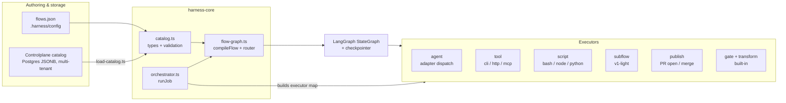
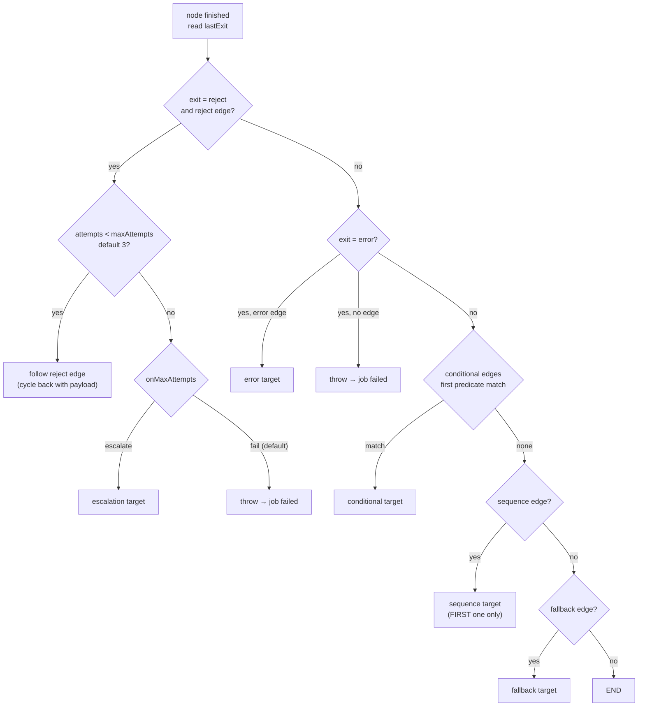
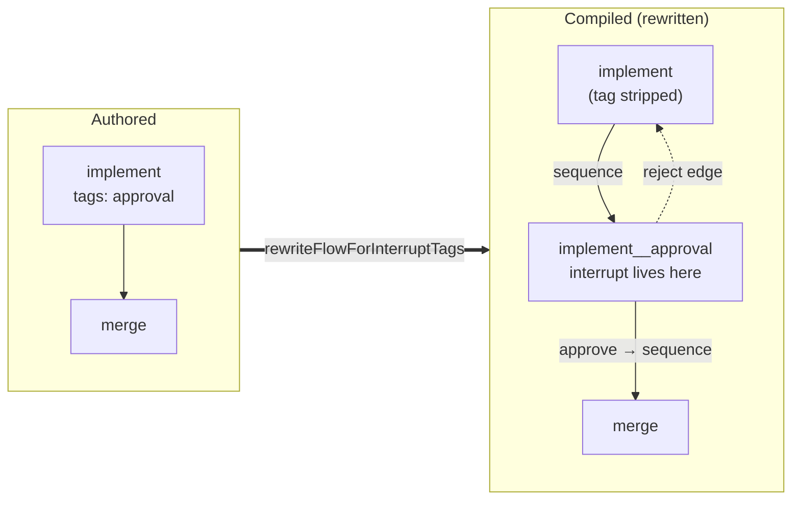
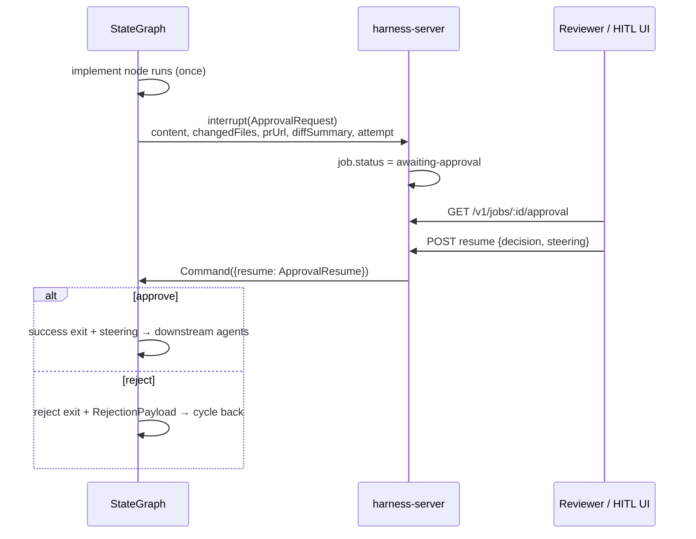
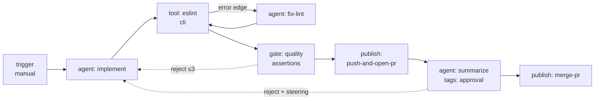

# Helmsmith Flow Spec — Design Reference & Critical Review

**Date:** 2026-08-07 · **Sources:** `platform/harness/harness-core/src/` (catalog.ts, flow-graph.ts, orchestrator.ts, executors), `platform/harness/harness-server/src/`, `platform/controlplane/service/.../catalog/` · **Status of the canonical spec:** the file code comments cite as canonical — `.plans/flow-designer-spec-v1.0.md` (referenced at `catalog.ts:15` and `catalog.ts:138`) — **does not exist in this repository**. This document reconstructs the spec from the code, which is currently the only source of truth.

---

## 1. Executive summary

Helmsmith's flow model is a **graph-of-TaskSteps** design: one polymorphic node primitive, five edge types that carry all routing logic, three behavioral tags, and a small tagged-union expression language. It compiles to a LangGraph `StateGraph` and executes through per-kind executors. The taxonomy is genuinely elegant and the validation layer is thorough and fail-fast.

The critical finding is a **spec-to-runtime honesty gap**. The type system and validator accept a materially larger language than the runtime executes:

- `policy` (retry / backoff / timeout / onError), `joinStrategy`, and `terminal: 'fail'` are validated and then **never read by any runtime code** — dead config.
- **Parallel fan-out does not exist.** The router returns exactly one next node; a second `sequence` edge from the same node is silently ignored, despite the taxonomy comment claiming edges replace "fork" and despite state reducers built specifically for parallel branches.
- **Trigger configs are decorative.** `webhook` / `schedule` / `event` / `message` shapes are validated, but no runtime infrastructure fires them; every flow effectively starts by manual submission.
- **Output contracts are unenforced at runtime.** `job-intent` emission — the seam the two-repo factory/fleet model depends on — has no parsing or enforcement machinery.
- **HITL is half-built.** Approval works mechanically (interrupt → resume), but `slaMs` is never enforced, and nothing checks the resuming caller against `assigneeRole`.
- **Durability defaults to none.** The checkpointer defaults to `MemorySaver`; a process restart loses every awaiting-approval / suspended job unless an operator wires a durable saver.

None of this is fatal — most gaps are documented in scattered comments — but the *validator accepting what the runtime ignores* is the pattern to fix first, because it converts author intent into silent no-ops.

---

## 2. Where the code lives

| Concern | Location |
|---|---|
| Type model + validation (de facto spec) | `harness-core/src/catalog.ts` (1,729 lines) |
| Graph compilation, router, expressions, tags | `harness-core/src/flow-graph.ts` (1,140 lines) |
| Job orchestration, agent executor, coverage matrix | `harness-core/src/orchestrator.ts` (1,209 lines) |
| Step executors | `tool-executor.ts`, `script-executor.ts`, `subflow-executor.ts`, `publish-executor.ts` |
| Server: HTTP surface, dispatcher, catalog loading | `harness-server/src/index.ts`, `dispatcher.ts`, `load-catalog.ts` |
| Storage (Java controlplane) | `controlplane/.../catalog/` — `Flow.java`, `FlowService`, `FlowDao`, `V0002__catalog_flows.sql` |

The Java side (`Flow.java`) deliberately stores `nodes` / `edges` as **opaque `JsonNode`** — validation on that side is deferred to "Phase 2" of the catalog PRD. TypeScript is authoritative; Java is dumb storage with tenancy, soft-delete, audit columns, and SSE change events.

---

## 3. The design model

### 3.1 Philosophy — one primitive, edges route, tags modify

The taxonomy comment (`catalog.ts:131-145`) states the design bet explicitly: **no** `if` / `loop` / `try` / `fork` / `map` step kinds. Control flow lives in edges; iteration and pausing live in tags; reliability lives in policy. Terminal nodes are simply nodes with no outgoing edges.

### 3.2 Node kinds (`TaskStep`, `catalog.ts:153`)

| Kind | Config | Executor | Notes |
|---|---|---|---|
| `agent` | `AgentDef` (adapter, prompt, `accepts` model bindings, `skillz` deps) | `orchestrator.ts` | The dominant kind. Accept-list resolution + per-agent cross-provider fallback on classified adapter errors. |
| `tool` | `toolId` + expression-resolvable `args` | `tool-executor.ts` | Dispatches `cli` (execFile, no shell), `http` (fetch + CredentialBroker auth), `mcp` (per-call server spawn). |
| `script` | `bash \| node \| python` + inline `source` | `script-executor.ts` | Temp-file + interpreter; state via stdin + `HARNESS_STATE_JSON`; 10MB stdout cap; SIGTERM→SIGKILL timeout. |
| `transform` | one `Expression` | built-in (`flow-graph.ts`) | Pure data shaping → `state.output`. Always succeeds. |
| `gate` | `assertions[]` | built-in (`flow-graph.ts`) | All pass → success; any fail → reject + `RejectionPayload`. |
| `subflow` | `flowId` + optional `input` | `subflow-executor.ts` | v1-light: inner flow may not contain agents or approval/suspend tags (compile-time ban). |
| `trigger` | `webhook \| schedule \| manual \| event \| message` | default success | Entry marker only — see §5.4. |
| `publish` | `push-and-open-pr` \| `merge-pr` | `publish-executor.ts` | Ships work as a PR; credentials via GitHub resolver cascade. |

### 3.3 Edges and the router (`flow-graph.ts:371`)

Five edge types: `sequence`, `conditional` (expression, first match wins), `fallback`, `error`, `reject`. Cardinality rules: at most one each of error / fallback / reject per source node. Only reject edges may form cycles — everything else must be a DAG (DFS check at validation).

Executors return errors **as data** (`NodeExit`), never throw for expected failures — a genuine throw bypasses error edges and fails the job. This is a clean, consistently applied contract across all executors.

### 3.4 Tags

- **Approval** (`assigneeRole`, `slaMs`, steering inputs, pessimistic concurrency): HITL gate emitting approve (sequence) or reject edges, with reviewer steering injected into retries — and, on approve, forwarded to downstream agents via the long-lived `steering` channel.
- **Suspend** (timer or event trigger): durable pause; resume is a bare wake-up signal.
- **Loop** (`collection` | `directory` source, `sequential` | `parallel` mode): iterates a single node over items; composes with the other tags.

Approval and Suspend are implemented via a **topology rewrite** (`rewriteFlowForInterruptTags`, `flow-graph.ts:715`): the tagged node is split from its interrupt so LangGraph's resume-re-runs-the-node semantics never re-invoke an LLM.

The approval pause/resume protocol:

### 3.5 Expression language (`catalog.ts:585`, evaluator `flow-graph.ts:437`)

Tagged union: `literal`, `jsonpath`, `compare` (`== != < <= > >= in`), `all`, `any`, `not`, and `js` — which **throws by design** (no sandbox; a deliberate, documented decision). Semantics are carefully specified: strict equality, `Number()` coercion with NaN ⇒ false, `in` as collection-membership only, vacuous-truth identities for empty `all` / `any`. Expressions drive conditional edges, gates, transforms, loop sources, tool args, and subflow inputs — one evaluator, many surfaces.

### 3.6 Flow kinds, output contracts, and state

`FlowDef.kind` ∈ `work` | `job-definition` | `post-job`; `job-definition` flows must declare `output: {kind: 'job-intent'}` and emit a `JobIntent` — the work-order seam between the factory (helmsmith) and the fleet (smithagents). `FlowOutputContract` also covers `agent-text`, `job-intents` (fan-out), `flow-spec`, and `structured`.

Runtime state (`FlowState`, `flow-graph.ts:83`) has nine channels; `messages`, `attempts`, `steering`, and `changedFiles` use merge reducers, everything else is last-write-wins. Cross-cutting capabilities that genuinely work: cooperative cancellation, operator steering (passive prompt-prefix + active CLI polling), changed-files discovery surfaced into approval payloads, per-job graph caching, and token accounting.

### 3.7 An example of what the model can express today

Retry-with-steering loops, error-edge recovery, quality gates, PR delivery, and human review compose exactly as designed. This is a real, working v1.

---

## 4. Honest coverage matrix

The matrix in `orchestrator.ts:309` is accurate for what it tracks — but it tracks step kinds, tags, edges, and expressions, not **node fields**. The full picture:

| Feature | Typed | Validated | Executed | Reality |
|---|:-:|:-:|:-:|---|
| Step kinds: agent, gate, transform, tool, script, publish | ✅ | ✅ | ✅ | Solid, well-tested (232 tests in harness-core) |
| Step kind: subflow | ✅ | ✅ | ⚠️ | Deterministic inner flows only; agents + interrupt tags banned (compile-time) |
| Step kind: trigger | ✅ | ✅ | ⚠️ | Entry marker only; the five trigger configs do nothing at runtime |
| Edges: sequence, conditional, fallback, error, reject | ✅ | ✅ | ✅ | Single-target routing only |
| **Parallel fan-out / join** | ✅* | ⚠️ | ❌ | Router follows the *first* sequence edge; extras silently dropped. *Implied by `joinStrategy` + reducer comments |
| `joinStrategy` (`all` / `any` / `nOfM`) | ✅ | ✅ | ❌ | Never read by runtime |
| `policy.retry` / `backoff` | ✅ | ✅ | ❌ | Never read; no per-node retry exists |
| `policy.timeout` | ✅ | ✅ | ❌ | Never read; only executor-internal defaults (30s/60s) apply |
| `policy.onError` (`continue` / `fallback`) | ✅ | ✅ | ❌ | Never read; error edge or throw are the only behaviors |
| `terminal: 'fail'` | ✅ | ✅ | ❌ | Never read; every terminal node routes to END as success |
| Tag: approval | ✅ | ✅ | ⚠️ | Interrupt/resume works; `slaMs` never enforced; no role check on resume |
| Tag: suspend | ✅ | ✅ | ⚠️ | Pauses correctly; no timer/event scheduler wakes it (`index.ts:480,600`) |
| Tag: loop | ✅ | ✅ | ⚠️ | Works; only last iteration's state delta survives; chunked parallelism; no sibling cancel; non-recursive directory |
| Expressions: literal, jsonpath, compare, all, any, not | ✅ | ✅ | ✅ | "jsonpath" is dot-path only — no indexing, wildcards, filters |
| Expression: `js` | ✅ | ✅ | ❌ | Throws by design (documented) |
| `FlowOutputContract` runtime enforcement | ✅ | ⚠️ | ❌ | Only static check: job-definition ⇒ job-intent. No terminal-output parsing, no JobIntent emission machinery |
| Durable pause across restart | — | — | ⚠️ | `MemorySaver` default; PG/SQLite swappable but nothing wires one by default |

---

## 5. Critical assessment

### 5.1 The canonical spec is a dangling pointer

`catalog.ts` twice cites `.plans/flow-designer-spec-v1.0.md` as "canonical reference." The file exists nowhere in the repo (likely lost in the monorepo migration — `.plans/` survives only as `docs/`). Consequences: the design rationale, the v1/v2 boundary, and the authored-intent for the dead fields below are unrecoverable except by code archaeology. **The code is the spec now**, and code comments disagree with each other in places (the `catalog.ts` header says the catalog lives at `.harness/config/pipelines.json`; `loadCatalog` at `catalog.ts:771` reads `flows.json`).

### 5.2 Dead config is the worst kind of gap

`policy`, `joinStrategy`, and `terminal` are **accepted by the validator and ignored by the runtime**. An author who writes `policy: { retry: { maxAttempts: 5 }, timeout: 120000, onError: 'continue' }` gets: no retries, executor-default timeouts, and flow-failure on error. The validator's thoroughness makes this worse, not better — passing strict validation reads as a promise that the config means something. A validator that *rejected* unimplemented fields (or a loud startup warning) would be strictly more honest than today's silent acceptance.

### 5.3 The parallel-shaped API with no parallelism

Three separate artifacts imply parallel branches: the taxonomy comment ("fork… replaced by edges — parallel split/join"), `joinStrategy` on every node, and the `messages` / `attempts` reducers documented as existing "so multiple parallel paths can write without clobbering." But `buildRouter` returns a single node id, and `out.find(e => e.type === 'sequence')` means a second sequence edge from the same node is **silently never followed** — not even a validation error. This is the sharpest correctness trap in the model: an author drawing a fan-out gets a flow that quietly executes only one branch. Loop's `parallel` mode is the only real concurrency, and it's within-node.

### 5.4 Triggers are decorative

Five trigger configs are validated in detail (cron strings, webhook paths, event matchers, message channels) — and none has runtime machinery. Jobs start via `POST /v1/jobs`; suspend wake-ups are explicitly the caller's job and no scheduler exists (`index.ts:480`, `:600`). Validating a cron expression the platform will never fire is spec theater. Either an ingress layer (scheduler + webhook router + event bus subscription) should land, or `webhook|schedule|event|message` should be marked unsupported at validation the way `js` expressions throw at evaluation.

### 5.5 The output-contract seam is unenforced

The factory/fleet architecture hinges on `job-definition` flows emitting `JobIntent`s that launch work flows. The types exist (`JobIntent`, `FlowOutputContract`), the static check exists — but nothing parses a terminal node's output against the contract, and no code path consumes an emitted intent. `{ kind: 'structured', schema }` requires a schema and then never validates anything against it. The platform's most strategically important contract is currently a type annotation.

### 5.6 HITL is mechanically sound, operationally incomplete

The interrupt topology rewrite is the best piece of engineering in the module (§6). But around it: `slaMs` is surfaced in the payload and enforced by nobody — an approval can hang forever; `assigneeRole` is display metadata — the resume route checks only that the job is paused, so any caller with socket access can approve anything; and "pessimistic concurrency" is a validated enum value with no locking implementation behind it. For a system whose pitch includes governed autonomous work, authorization on the approve path is the gap I'd close first.

### 5.7 Durability is opt-in and defaulted off

`compileFlow` attaches `MemorySaver` unless told otherwise. The `SuspendTag` docstring promises "serializes state, kills the worker, hydrates a new worker" — with the default checkpointer, killing the worker loses the job. Nothing in harness-server wires a durable saver. The design supports durability; the deployment default contradicts the design's story.

### 5.8 Smaller sharp edges

- **"jsonpath" isn't JSONPath.** Dot-path only — no `[0]`, no wildcards, no filters. Fair v1 scope, misleading name; authors will paste real JSONPath and get `undefined`, which coerces to a false predicate rather than an error.
- **Loop state semantics are lossy.** Only the last iteration's non-output state delta survives; a failed parallel chunk discards its siblings' completed work; directory source is non-recursive by design.
- **Synthetic interrupt nodes lie to the type system.** They're minted as `kind: 'agent'` with a cast placeholder `AgentDef` (`flow-graph.ts:729-744`); any future code that walks the *rewritten* flow's agent nodes will trip over ghosts. A dedicated internal kind would cost little.
- **Transform stringifies `undefined`** into the literal string `"undefined"` (documented, still a footgun).
- **`changedFiles` only grows** — a file reverted mid-flow stays in the reviewer's diff surface forever (documented as intentional "cumulative" semantics; still surprising).
- **Legacy residue:** `linearFlowFromAgents` hardcodes skipping agents named `coordinator` / `checkout-coordinator`.
- **Two-language catalog risk:** when Java Phase 2 validation lands, the rules in `catalog.ts` must be re-implemented in Java — with no shared schema artifact, drift is a matter of time. Until then, controlplane happily persists garbage flows that fail only when a harness loads them.

---

## 6. What's genuinely good

- **The taxonomy.** One node primitive + edges-carry-routing + tags-as-modifiers is teachable, renders naturally on a canvas, and avoids the step-kind explosion every workflow DSL eventually regrets (AWS Step Functions' `Choice`/`Map`/`Parallel` sprawl is the cautionary tale this design clearly studied).
- **The interrupt rewrite.** Isolating `interrupt()` in a synthetic node so resume never re-runs an LLM call is a subtle, correct answer to a real LangGraph footgun — and it composes with reject-cycle steering.
- **Errors as data.** The `NodeExit` contract (executors never throw for expected failures) gives error edges universal, predictable semantics across seven executor families.
- **Fail-fast validation with located errors.** Path-prefixed messages (`flows[2].nodes[1].config.toolId ...`), referential integrity, cycle detection, reject-source restrictions, compile-time subflow validation — authors learn at load time, not mid-job.
- **Security posture.** `execFile` with no shell anywhere, credentials by reference through a single broker for agents and tools alike, script state passed as data (stdin/env) never interpolated into commands.
- **Discipline in documentation.** "Concerns NOT here" headers, the coverage-matrix habit, and deferred-work lists with *reasons* — the gaps in §5 are mostly findable because the code confesses them.
- **Test density.** 232 tests across harness-core, 88 on flow-graph alone.

---

## 7. Recommendations, prioritized

1. **Make the validator honest (cheap, high value).** Reject or warn on `policy`, `joinStrategy`, `terminal: 'fail'`, non-manual triggers, and >1 sequence edge per node until each is implemented. One afternoon of work; eliminates the entire silent no-op class. — **✅ Done (2026-08-07):** `@helmsmith/flow-spec` ships an `onUnsupported` reporting seam covering all of these plus `js` expressions; harness-core's `loadCatalog` warns one line per finding.
2. **Re-establish the spec.** Commit a canonical spec (this document can seed it) and fix the two dangling `.plans/` references plus the `pipelines.json` / `flows.json` drift. — **✅ Partially done (2026-08-07):** the spec now lives as code in `platform/harness/flow-spec/` (types + validation + expression semantics + conformance fixtures); both dangling references and the `pipelines.json` drift are fixed.
3. **Close the approve-path authz gap** and enforce `slaMs` (auto-reject timer on the server). Smallest change with the largest governance payoff.
4. **Decide on parallelism.** Either implement fan-out/join (LangGraph supports multi-target conditional edges; the reducers are already there, `joinStrategy` becomes real) or delete `joinStrategy` and validate single-sequence — the half-state is the worst state.
5. **Enforce output contracts at the terminal node** — parse `job-intent` output, validate `structured` schemas. The factory/fleet seam needs teeth before smithagents depends on it.
6. **Default to a durable checkpointer** (SQLite file per workspace) so paused jobs survive restarts out of the box.
7. **Implement `policy`** (retry with backoff is the most-wanted; `onError: 'continue'` second) — or excise it.
8. **Trigger ingress** (scheduler + webhook + event subscription) as its own slice, or demote trigger configs to `manual`-only until then.
9. **Rename or upgrade `jsonpath`**; add array indexing when a real catalog needs it.
10. **Share one schema across languages** — generate JSON Schema from the TS types and validate against it in both harness-core and controlplane Phase 2, so the rules can't drift. — *Home decided (2026-08-07): schema generation belongs in `@helmsmith/flow-spec` when Phase 2 lands.*
