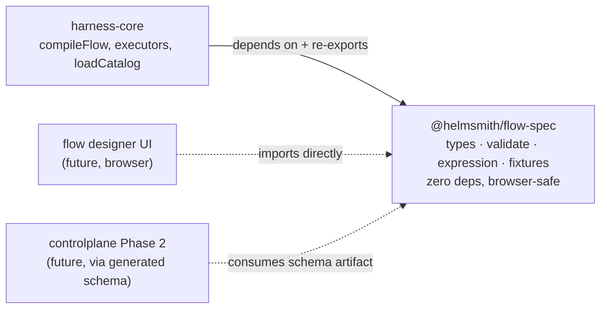
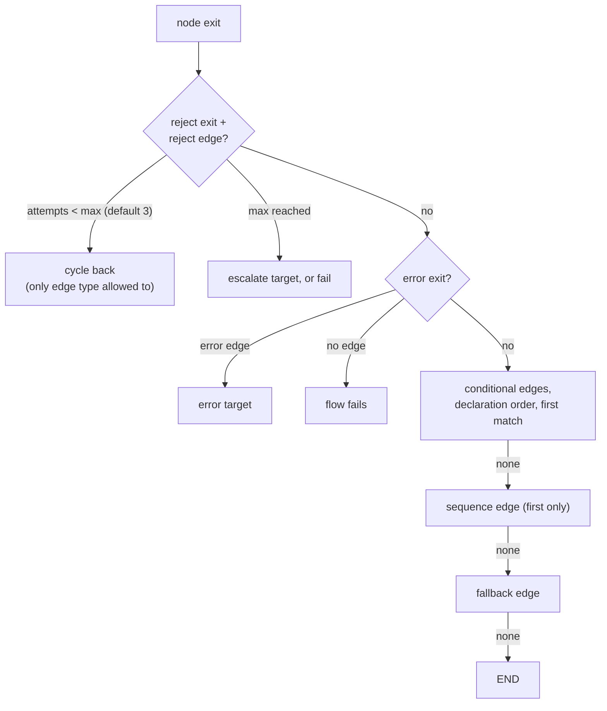
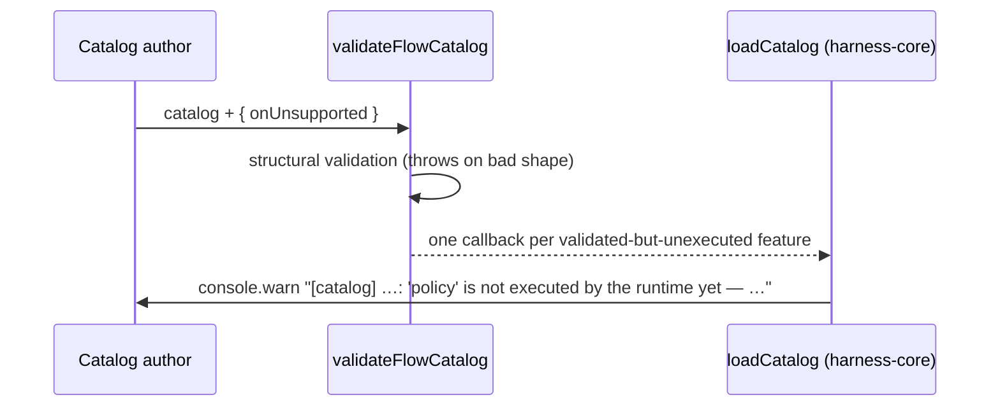

# @helmsmith/flow-spec — Specification & Critical Notes

**Package:** `platform/harness/flow-spec` · **Version:** 0.0.0 (private, source-shipped) · **Date:** 2026-08-07 · **Landed via:** PR #13 (`feat/flow-spec-package`)

This document is the detailed companion to the package `README.md`: the full contract the package defines, the exact semantics its code implements, and a critical assessment of the package **as it stands today** — including defects found while writing this document. The pre-extraction critique of the whole flow *runtime* lives in `docs/superpowers/specs/2026-08-07-flow-spec-design-review.md`; runtime findings are only summarized here, not repeated.

---

## 1. Purpose and boundary

`@helmsmith/flow-spec` is the **flow wire contract as code**: the types stored in controlplane's catalog tables, the validator that accepts or rejects a catalog, the expression evaluator whose answers routing decisions depend on, and the conformance fixtures that pin those answers down. It exists so three consumers can share one definition without sharing a runtime:

Two hard rules define the boundary:

1. **Browser-safe:** zero runtime dependencies, no `node:*` imports. `loadCatalog` (fs) stayed behind in harness-core for exactly this reason.
2. **Dependency direction:** harness-core → flow-spec, never back. The evaluator was retyped from LangGraph's `FlowStateT` to structural `unknown` before the split because this rule makes reaching back for runtime types impossible afterward.

Deliberately **not** here: graph compilation, routing, executors (harness-core); catalog loading (harness-core); anything shared with smithagents — the factory/fleet seam is work orders, not code, so external consumers get a schema artifact, never this npm package.

## 2. Module map

| Module | Exports | Role |
|---|---|---|
| `types.ts` (~790 lines) | `FlowDef`, `TaskStep`, `Edge`, `Expression`, tags, policy, `FlowOutputContract`, `JobIntent`, `ToolDef` family, `ProductDef`/`ProductRepo`/`ContextSourceDef`, `FlowCatalog`/`Catalog`, `CatalogError`, `walkAgents`, `resolveAccepts`, `findFlow`, `findProduct` | The wire shapes, moved verbatim from harness-core's `catalog.ts` |
| `validate.ts` | `validateFlowCatalog`, `validateUnifiedCatalog`, `ValidateOptions`, `UnsupportedFeature` | Fail-loud structural validation + the unsupported-feature reporting seam |
| `expression.ts` | `evalExpression`, `resolveExpressionValue`, `resolveJsonPath` | Expression semantics, shared verbatim by the runtime router and any future designer preview |
| `fixtures.ts` | `ExpressionCase`, `EXPRESSION_CASES` (14 cases) | Executable spec data; replayed by this package's tests and harness-core's `flow-spec-conformance.test.ts` |
| `index.ts` | wildcard re-export of all four | Public surface (see §7.2 for why "wildcard" is a critique) |

## 3. The contract in detail

### 3.1 One primitive, edges route, tags modify

A flow is a graph of `TaskStep` nodes — one polymorphic primitive discriminated by `kind` — plus typed edges that carry **all** routing logic. There are deliberately no `if` / `loop` / `try` / `fork` / `map` step kinds. Terminal nodes are nodes with no outgoing edges.

| `kind` | Config | Purpose |
|---|---|---|
| `trigger` | `manual` \| `webhook` \| `schedule` \| `event` \| `message` | Entry marker; exactly one per flow |
| `agent` | `AgentDef` — adapter, prompt, `accepts` model bindings (flat or named sets), `fallbackOn`, `skillz` | LLM work; the dominant kind |
| `tool` | `toolId` + expression-resolvable `args`, resolved to a `CliToolDef` \| `HttpToolDef` \| `McpToolDef` | Deterministic call |
| `script` | `bash` \| `node` \| `python` + inline `source` | Batch subprocess, state via stdin + env |
| `transform` | one `Expression` | Pure data shaping into `state.output` |
| `gate` | `assertions[]` (expression + message) | All pass → success; any fail → reject with payload |
| `subflow` | `flowId` + optional `input` | Composed inner flow (deterministic-only in v1) |
| `publish` | `push-and-open-pr` \| `merge-pr` | Ship the work as a PR |

Edge types and the routing precedence the runtime implements (spec'd here so a designer can preview it):

Structural rules the validator enforces: exactly one trigger (no incoming, ≥1 outgoing); ≤1 each of error/fallback/reject edges per source; reject edges only from `gate` or approval-tagged nodes; reject-edge `onMaxAttempts.escalate` targets must exist; everything except reject edges must form a DAG.

### 3.2 Tags and policy

`tags.approval` (HITL gate: `assigneeRole`, `slaMs`, steering inputs) and `tags.suspend` (timer/event pause) are mutually exclusive; `tags.loop` (collection/directory source, sequential/parallel mode) composes with either. `policy` (retry/backoff/timeout/onError), `joinStrategy` (`all`/`any`/`nOfM`), and `terminal: 'fail'` are **part of the wire contract but not executed by the runtime** — they validate, then report through `onUnsupported` (§5).

### 3.3 Expression language — semantics, including the sharp edges

Tagged union: `literal`, `jsonpath`, `compare`, `all`, `any`, `not`, `js`. The evaluator in `expression.ts` is the single source of truth; `EXPRESSION_CASES` pins 14 behaviors. The table below documents what the code **actually does**, including three behaviors discovered while writing this document that the inline docs get wrong or omit (critique in §7.3):

| Construct | Semantics |
|---|---|
| `literal` | `Boolean(value)` as predicate; raw value via `resolveExpressionValue` |
| `jsonpath` | Dot-path only: `$`, `$.a.b`. Missing/non-object intermediate → `undefined`, never throws. Dot-numeric array indexing (`$.arr.0`) is **supported and pinned by fixture**; out-of-bounds → `undefined`. No bracket syntax, wildcards, or filters |
| `compare ==` / `!=` | Strict `===`/`!==`. No coercion: `"5" == 5` is false. Objects compare by **reference** — two structurally equal objects from jsonpath are never `==` (pinned by fixture) |
| `compare <` `<=` `>` `>=` | Both sides through `Number()`; NaN on either side ⇒ false (both `NaN < 5` and `NaN >= 5` are false) |
| `compare in` | rhs must resolve to an array, else false (no substring semantics). Membership via `Array.includes` — **SameValueZero, not strict equality**: `NaN` self-matches (reachable only from runtime state; JSON can't encode NaN — pinned by code-level test, kept out of fixtures so they stay JSON-serializable) |
| `all` / `any` | Short-circuit AND/OR; `all([])` ⇒ true, `any([])` ⇒ false (identity elements) |
| `not` | Predicate inversion |
| `js` | **Throws.** Deliberate: no sandbox dependency; compose the boolean primitives instead |
| composition as value | `compare`/`all`/`any`/`not` under `resolveExpressionValue` collapse to their boolean — no surprising polymorphism |

### 3.4 Flow kinds and output contracts

`FlowDef.kind` ∈ `work` (default) | `job-definition` | `post-job`. A `job-definition` flow must declare `output: { kind: 'job-intent' }` (statically enforced) and emit a `JobIntent` — the factory/fleet work-order seam. `FlowOutputContract` also admits `agent-text`, `job-intents` (min/max fan-out), `flow-spec`, `structured` (schema required). Runtime enforcement of the contract against terminal-node output does not exist yet (inherited gap, §7.5).

### 3.5 Catalog and product shapes

`FlowCatalog` (`flows[]`) and `Catalog` (adds `products?[]` — `ProductDef` with `contextSources` and `repos`). Products are admin-owned tenancy shapes; they ride along in this package because the unified catalog validator needs them (see §7.2 for whether they belong).

## 4. Validation

`validateFlowCatalog` / `validateUnifiedCatalog` are assert-style, throwing `CatalogError` with path-prefixed messages (`test: flows[0].nodes[2].config.toolId must be …`). Coverage: catalog shape, per-flow kind/output rules, per-node kind + per-kind config shape, tags (approval/suspend exclusivity, loop shape), policy/joinStrategy/terminal shapes, per-edge shape + referential integrity + cardinality + reject-source restrictions, trigger constraints, DAG check, duplicate ids (flows, nodes, agents, products, repos), `accepts` forms, `fallbackOn` against the closed AdapterError name set, `skillz` key set.

Validation is **structural only** — it answers "is this shaped like a flow?", never "will this flow do what it says?" The second question is exactly what §5 exists for.

## 5. The unsupported-feature contract

`ValidateOptions.onUnsupported` fires for: `policy`, `joinStrategy`, `terminal-fail`, `trigger-<kind>` (non-manual), `expression-js` (recursive scan of the whole flow), `parallel-fan-out` (second+ sequence edge from one node — the runtime router silently follows only the first). Reporting never changes accept/reject behavior; no callback ≡ pre-extraction semantics.

**The governing rule** (from the README): when the runtime starts executing a feature, its report is deleted *in the same change*. The report list is the honest coverage boundary between spec and runtime.

## 6. Conformance

`EXPRESSION_CASES` is plain data — `{ name, expr, state, expected }` — so conformance is a replay, not an import of behavior. Today two suites replay it: `fixtures.test.ts` (the spec testing itself) and harness-core's `flow-spec-conformance.test.ts` (the runtime proving its re-exported evaluator matches). A future designer preview or Java validator conforms the same way. Semantics change by changing the fixture first; every conforming implementation fails until it catches up.

---

## 7. Critical feedback — the package as it stands

### 7.1 What the extraction genuinely fixed

The canonical-spec dangling pointer is gone (this package is the spec; both stale `.plans/` references and the `pipelines.json` drift were corrected in the move). The silent-no-op class is closed at load time via `onUnsupported`. The evaluator is shareable by construction (structural state). Expression semantics are pinned by fixtures that the runtime demonstrably replays. Compatibility was proven, not assumed (baseline 216 tests → 230, verified by stash comparison).

### 7.2 Boundary critiques — what "flow-spec" carries that isn't flow spec

- **The wildcard export surface is unguarded.** `index.ts` does `export *` from four modules, and harness-core's `catalog.ts` does `export *` again. Any symbol added to any flow-spec module instantly becomes public API of *two* packages, with no curation point. A deliberate named-export `index.ts` would make API growth a reviewed decision. This is the highest-leverage cheap fix in the package.
- **`AdapterId = 'claude-sdk' | 'opencode-cli'` bakes two runtime implementations into the wire contract.** Adding an adapter is now a spec change, and the closed union lives in the package that's supposed to outlast runtime choices. The spec-shaped alternative is `string` with a registry check at runtime (matching how `toolId` and `flowId` already work: reference in spec, resolution at runtime).
- **`ToolResolver` and `FlowResolver`-adjacent function types are runtime seams, not wire shapes.** A `(toolId) => ToolDef | undefined` lookup signature can't be stored, serialized, or rendered — it describes harness-core's dispatch, and it migrated here only because it sat in the same file. Same question, softer, for `walkAgents`/`resolveAccepts`: useful helpers, but they encode consumption patterns, not contract.
- **Product/tenancy shapes (`ProductDef`, `ProductRepo`, `ContextSourceDef`) make this a *catalog*-spec, not a *flow*-spec.** They're here because `validateUnifiedCatalog` needs them, which is defensible — but then the package is misnamed, and a designer UI importing flow types drags in git-clone-URL shapes. Either name the package for what it holds (catalog-spec) or split product shapes out when the designer becomes real.

### 7.3 Semantic honesty gaps — found while writing this document, verified against the code

> **Status update (2026-08-07, same PR):** the first three findings below are now **resolved by pinning** — dot-numeric array indexing, object reference-equality for `==`, and out-of-bounds behavior are fixture cases (replayed by harness-core's conformance suite); SameValueZero `in` is pinned by a code-level test (NaN can't live in JSON-serializable fixtures — a serializability guard test now enforces that property too); all doc comments in `expression.ts` and `types.ts` were corrected to match the code. The original findings are preserved below as the record of what documentation-as-audit caught.

- **Array indexing secretly worked.** `resolveJsonPath('$.repos.0', …)` returns element 0 (JS string-indexing on arrays), while the doc comments claimed "no array indexing." Undocumented + unfixtured = unstable. *Resolution: pinned as supported — fixture + docs; a future JSONPath upgrade now breaks conformance instead of catalogs.*
- **`in` is SameValueZero, not strict equality.** `[NaN].includes(NaN)` is true while `NaN === NaN` is false; the docs said "strict equality." *Resolution: documented as SameValueZero, pinned by code-level test.*
- **`==` on objects is reference equality.** Two jsonpath resolutions of structurally identical objects are never equal. Correct but surprising for `$.a == $.b` on non-primitives. *Resolution: documented + pinned by fixture.*
- **`scanForJsExpressions` can false-positive on inert data.** A `literal` whose `value` happens to contain `{ kind: 'js', expression: '…' }` (or tool args carrying such a shape as data) is reported as a js *expression* even though the evaluator would never evaluate it. Harmless today (warning only), but it means the report's `where` paths can point at data, not expressions. Walking only known expression positions (edge conditions, gate assertions, transform/config expressions, loop paths, matchers) would be precise. **Still open.**

### 7.4 Enforcement gaps — where the package still runs on convention

- **The `onUnsupported` list is hand-maintained with no test tying it to the runtime.** The README's "delete the report in the same change" rule is convention. The conformance idea already in the package points at the fix: a fixture set of `(flow, expectedUnsupportedFeatures)` pairs that harness-core replays — implementing a feature then *fails the conformance test* until the report is removed.
- **Only expressions have fixtures.** Validation verdicts (valid/invalid catalogs + expected error substrings) and unsupported-feature expectations are tested in `validate.test.ts` but not published as replayable data — so a Java Phase 2 validator or designer can conform to expression semantics today but not to validation semantics. The plan's original `validation-cases` idea is still worth shipping.
- **No schema artifact yet.** The two-language drift risk from the original review is unchanged: controlplane still stores opaque JSONB and Phase 2 would hand-port these rules. This package is the agreed home for generated JSON Schema; until it exists, the seam is TypeScript-only.
- **The package has no `test` script**, so `pnpm -r test` / `test:packages` skip it; its tests run only when root vitest is invoked with the right path. Consistent with harness-core's pattern, but for the package positioned as *the contract*, a one-line `"test": "vitest run ."` would make its suite unskippable.
- **Version 0.0.0, private, no changeset wiring.** Fine while the only consumer is in-repo; becomes a real gap the day the designer UI or a schema-publishing pipeline needs a versioned contract. Semver discipline was one of the stated reasons to extract — the mechanics aren't set up yet.

### 7.5 Inherited runtime gaps (context, not this package's debt)

Still true, now *warned* rather than silent: `policy`/`joinStrategy`/`terminal-fail` unexecuted; no parallel fan-out; non-manual triggers decorative; output contracts unenforced at runtime; approval `slaMs`/role unenforced; `MemorySaver` durability default. Details and priorities: `docs/superpowers/specs/2026-08-07-flow-spec-design-review.md` §5–§7.

## 8. Recommendations, prioritized

1. **Curate the export surface** — replace both `export *` layers with named exports; decide `ToolResolver`'s home while doing it. (Hours, prevents silent API growth forever.)
2. **Pin or reject the discovered semantics** — fixture for dot-numeric array access (or validation error), doc lines for SameValueZero `in` and reference-equality `==`. The fixtures file exists precisely so these can't drift. — **✅ Done (2026-08-07): pinned.** 17 fixture cases (+ JSON-serializability guard), NaN case as a code-level test, all doc comments corrected.
3. **Ship validation + unsupported-feature fixtures** — make conformance cover all three behaviors the package defines (validation verdicts, expression results, coverage warnings), and add the harness-core replay that turns the README's delete-the-report rule into a failing test.
4. **Narrow `scanForJsExpressions` to known expression positions.**
5. **Generate JSON Schema from the types** in this package's build — the controlplane Phase 2 dependency and the smithagents seam artifact both want it.
6. **Loosen `AdapterId` to a registry-checked string** when the next adapter lands — don't pay the spec-change tax twice.
7. **Add the `test` script; wire changesets** when the first out-of-repo consumer appears.
