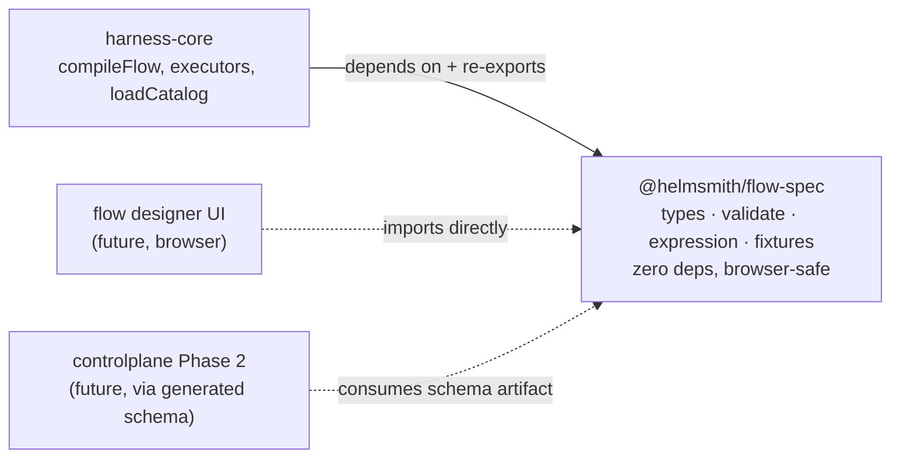
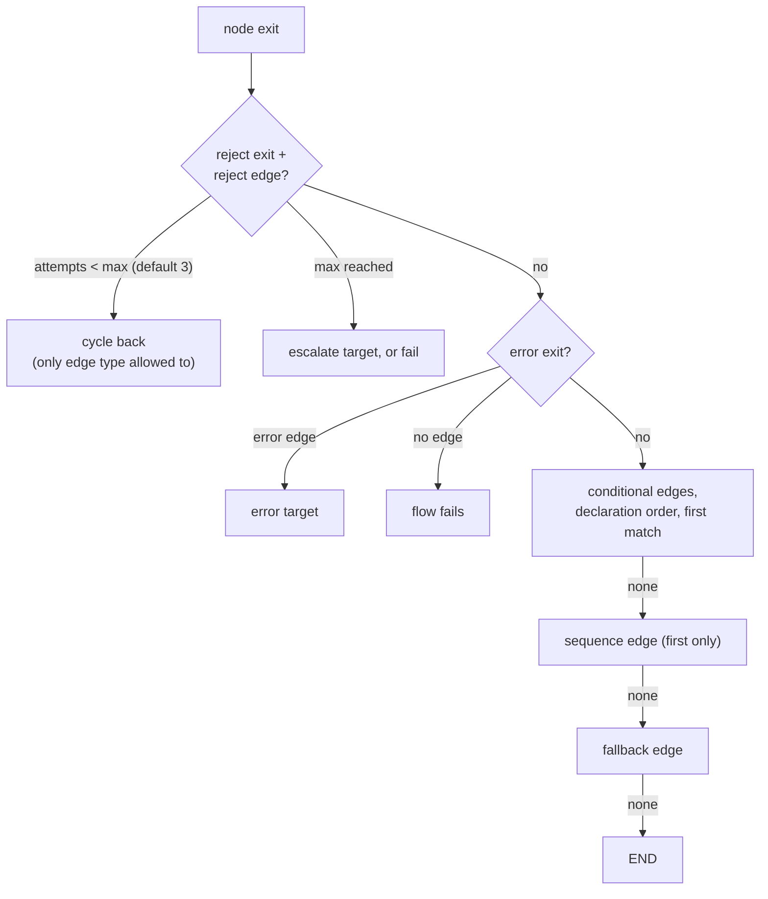
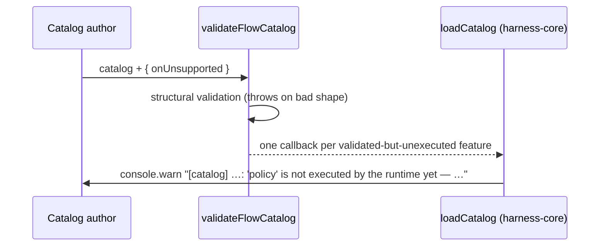

# @helmsmith/flow-spec — Specification & Critical Notes

**Package:** `platform/harness/flow-spec` · **Version:** 0.0.0 (private, source-shipped) · **Date:** 2026-08-07 · **Updated:** 2026-08-12 (data-plane contract: run state, node I/O, error matchers, expression additions; validator-consistency pass: load-time path syntax, error-edge shadow rejection, min ≤ max) · **Landed via:** PR #13 (`feat/flow-spec-package`)

This document is the detailed companion to the package `README.md`: the full contract the package defines and the exact semantics its code implements. Critique and roadmap live in dedicated docs (see §7 for the map). The pre-extraction critique of the whole flow *runtime* lives in `docs/superpowers/specs/2026-08-07-flow-spec-design-review.md`; runtime findings are only summarized here, not repeated.

---

## 1. Purpose and boundary

`@helmsmith/flow-spec` is the **flow wire contract as code**: the types stored in controlplane's catalog tables, the validator that accepts or rejects a catalog, the expression evaluator whose answers routing decisions depend on, and the conformance fixtures that pin those answers down. It exists so three consumers can share one definition without sharing a runtime:

Two hard rules define the boundary:

1. **Browser-safe:** zero runtime dependencies, no `node:*` imports. `loadCatalog` (fs) stayed behind in harness-core for exactly this reason.
2. **Dependency direction:** harness-core → flow-spec, never back. The evaluator was retyped from LangGraph's `FlowStateT` to structural `unknown` before the split because this rule makes reaching back for runtime types impossible afterward.

Deliberately **not** here: graph compilation, routing, executors (harness-core); catalog loading (harness-core); anything shared with smithagents — the factory/fleet seam is work orders, not code, so external consumers get a schema artifact, never this npm package.

## 2. Module map

| Module | Exports | Role |
|---|---|---|
| `types.ts` (~1000 lines) | `FlowDef`, `TaskStep` (incl. `input`/`output`/`effect`), `NodeOutputContract`, `Edge` (incl. `ErrorEdge.on`), `Expression`, tags, policy, `FlowOutputContract`, `JobIntent`, `ToolDef` family, `ProductDef`/`ProductRepo`/`ContextSourceDef`, `FlowCatalog`/`Catalog`, `CatalogError`, run-side wire shapes (`FlowRunState`, `NodeExit`, `ChangedFile`, `ApprovalRequest`/`ApprovalResume`, `SuspendRequest`), `walkAgents`, `resolveAccepts`, `findFlow`, `findProduct` | The wire shapes — definition side AND run side |
| `validate.ts` | `validateFlowCatalog`, `validateUnifiedCatalog`, `ValidateOptions`, `UnsupportedFeature` | Fail-loud structural validation + the unsupported-feature reporting seam |
| `expression.ts` | `evalExpression`, `resolveExpressionValue`, `resolveJsonPath` | Expression semantics, shared verbatim by the runtime router and any future designer preview |
| `output.ts` | `parseFlowOutput`, `FlowOutputParseResult` | Terminal output-contract enforcement (job-intent/job-intents shape + min/max, flow-spec re-validation, structured parse); the runtime's `finalizeOrPause` fails jobs through this |
| `fixtures.ts` | `ExpressionCase`/`EXPRESSION_CASES` (28 cases, `expectedValue` pins value semantics), `ValidationCase`/`VALIDATION_CASES`, `UnsupportedCase`/`UNSUPPORTED_CASES` — all JSON-serializability guarded | Executable spec data for all three behaviors; replayed by this package's tests and harness-core's `flow-spec-conformance.test.ts` |
| `index.ts` | wildcard re-export of all four | Public surface (see `docs/critical-feedback.md` §2 for why "wildcard" is a critique) |

## 3. The contract in detail

### 3.1 One primitive, edges route, tags modify

A flow is a graph of `TaskStep` nodes — one polymorphic primitive discriminated by `kind` — plus typed edges that carry **all** routing logic. There are deliberately no `if` / `loop` / `try` / `fork` / `map` step kinds. Terminal nodes are nodes with no outgoing edges.

| `kind` | Config | Purpose |
|---|---|---|
| `trigger` | `manual` \| `webhook` \| `schedule` \| `event` \| `message` | Entry marker; exactly one per flow |
| `agent` | `AgentDef` — adapter, prompt, `accepts` model bindings (flat or named sets), `fallbackOn`, `skillz` | LLM work; the dominant kind |
| `tool` | `toolId` + expression-resolvable `args`, resolved to a `CliToolDef` \| `HttpToolDef` \| `McpToolDef` | Deterministic call |
| `script` | `bash` \| `node` \| `python` + inline `source` + `secrets` (broker-resolved env credentials) | Batch subprocess, state via stdin + env |
| `transform` | one `Expression` | Pure data shaping into `state.output` |
| `gate` | `assertions[]` (expression + message) | All pass → success; any fail → reject with payload |
| `subflow` | `flowId` + optional `input` | Composed inner flow (deterministic-only in v1) |
| `publish` | `push-and-open-pr` \| `merge-pr` | Ship the work as a PR |

Edge types and the routing precedence the runtime implements (spec'd here so a designer can preview it):

Structural rules the validator enforces: exactly one trigger (no incoming, ≥1 outgoing); ≤1 each of fallback/reject edges per source; error edges — any number carrying `on` matchers plus ≤1 catch-all (no/empty `on`), routed by `NodeExit.errorName` (first declared match wins, catch-all last), and each error name may appear at most once across a source's error edges (a shadowed name could never fire, so it is rejected); reject edges only from `gate` or approval-tagged nodes; reject-edge `onMaxAttempts.escalate` targets must exist; everything except reject edges must form a DAG.

### 3.1.1 Node I/O — the data plane

Every `TaskStep` may declare `input`, `output`, and `effect`:

- **`input`** (executed): an Expression or a Record of name → Expression, resolved against `FlowRunState` into the node's *effective input* — the prompt for agents, stdin for scripts, `$.output` for everything else. This replaces the implicit "previous node's output string" contract when a node needs more than one upstream value. The single-Expression form is detected by a string `kind` field, so mapping keys must not be named `kind`. Runs inside the Loop wrapper (a looped node's mapping sees the per-item state).
- **`output`** (`NodeOutputContract`, executed except schema): `{ kind: 'json' }` parses the node's output string into `state.nodes[id]`; invalid JSON → `errorName: 'OutputParseError'` (error-edge routable). `schema` is recorded but not enforced (§5). Omitted/`text` → the raw string is recorded.
- **`effect`** (declared only, §5): `'pure' | 'idempotent' | 'side-effecting'` — replay/retry safety classification for the durable-checkpointer future.

### 3.1.2 The run-state contract

`FlowRunState` is the wire shape expressions bind against — the data plane made explicit: `input` (job payload, write-once), `nodes` (per-node outputs keyed by id, merge-reduced so parallel branches can't clobber), `output` (legacy latest-string channel), plus routing bookkeeping (`lastExit`, `rejectionPayload`, `attempts`) and operator surfaces (`steering`, `changedFiles`, `cancelRequested`). harness-core's `FlowStateT` is compile-time-asserted to satisfy it (`flow-graph.ts`), so a channel rename or type drift stops the build. The HITL payloads (`ApprovalRequest`/`ApprovalResume`, `SuspendRequest`) and `ChangedFile` live here too — a reviewer UI and the runtime must agree on them for the same reason a designer preview and the router must agree on expressions.

### 3.2 Tags and policy

`tags.approval` (HITL gate: `assigneeRole`, `slaMs`, steering inputs) and `tags.suspend` (timer/event pause) are mutually exclusive; `tags.loop` (collection/directory source, sequential/parallel mode) composes with either. `policy` (retry/backoff/timeout/onError), `joinStrategy` (`all`/`any`/`nOfM`), and `terminal: 'fail'` are **part of the wire contract but not executed by the runtime** — they validate, then report through `onUnsupported` (§5).

### 3.3 Expression language — semantics, including the sharp edges

Tagged union: `literal`, `jsonpath`, `compare`, `all`, `any`, `not`, `js`. The evaluator in `expression.ts` is the single source of truth; `EXPRESSION_CASES` pins 17 behaviors. The table below documents what the code **actually does**, including three behaviors discovered by documentation-as-audit and since pinned (record in `docs/critical-feedback.md` §1):

| Construct | Semantics |
|---|---|
| `literal` | `Boolean(value)` as predicate; raw value via `resolveExpressionValue` |
| `jsonpath` | Dot-path only: `$`, `$.a.b`. Missing/non-object intermediate → `undefined`, never throws. Dot-numeric array indexing (`$.arr.0`) is **supported and pinned by fixture**; out-of-bounds → `undefined`. No bracket syntax, wildcards, or filters. Malformed paths (no `$` prefix, empty segments) are rejected by the validator at load time — the evaluator itself still resolves any runtime miss to `undefined` |
| `compare ==` / `!=` | Strict `===`/`!==`. No coercion: `"5" == 5` is false. Objects compare by **reference** — two structurally equal objects from jsonpath are never `==` (pinned by fixture) |
| `compare <` `<=` `>` `>=` | Both sides through `Number()`; NaN on either side ⇒ false (both `NaN < 5` and `NaN >= 5` are false) |
| `compare in` | rhs must resolve to an array, else false (no substring semantics — that's `contains`). Membership via `Array.includes` — **SameValueZero, not strict equality**: `NaN` self-matches (reachable only from runtime state; JSON can't encode NaN — pinned by code-level test, kept out of fixtures so they stay JSON-serializable) |
| `compare contains` / `startsWith` / `endsWith` | String-only: both sides must resolve to strings, else false — no coercion, mirroring `in`'s strictness (pinned by fixtures) |
| `compare matches` | Both sides strings; `new RegExp(rhs).test(lhs)`, no flags. Invalid pattern from state ⇒ false (the evaluator never throws on data — pinned by code-level test); invalid **literal** patterns are rejected at load time by the validator |
| `all` / `any` | Short-circuit AND/OR; `all([])` ⇒ true, `any([])` ⇒ false (identity elements) |
| `not` | Predicate inversion |
| `exists` | Presence, not truthiness: false only for `undefined` (missing path); `null`/`false`/`0`/`""` all exist (pinned by fixtures) — the escape hatch from the silent-`undefined` jsonpath semantics |
| `object` / `array` | Constructors: fields/items resolved via `resolveExpressionValue`; always true as predicates (containers are truthy). The data-shaping half of the language — with these, `transform` + `output.kind: 'json'` builds structured `$.nodes.<id>` values |
| `js` | **Throws.** Deliberate: no sandbox dependency; compose the boolean primitives instead |
| composition as value | `compare`/`all`/`any`/`not`/`exists` under `resolveExpressionValue` collapse to their boolean — no surprising polymorphism |

### 3.4 Flow kinds and output contracts

`FlowDef.kind` ∈ `work` (default) | `job-definition` | `post-job`. A `job-definition` flow must declare `output: { kind: 'job-intent' }` (statically enforced) and emit a `JobIntent` — the factory/fleet work-order seam. `FlowOutputContract` also admits `agent-text`, `job-intents` (min/max fan-out), `flow-spec`, `structured` (schema required). **Runtime enforcement exists** (2026-08-12): `parseFlowOutput` runs at the terminal — job-intent(s) are shape-checked (+min/max), flow-spec emissions are re-validated through the catalog validator, structured output must parse as JSON; violation fails the job, success records `job.flowOutput`. Only `structured.schema` remains unenforced (reported as `flow-output-schema`), and nothing yet *submits* the recorded intent onward.

### 3.5 Catalog and product shapes

`FlowCatalog` (`flows[]`) and `Catalog` (adds `products?[]` — `ProductDef` with `contextSources` and `repos`). Products are admin-owned tenancy shapes; they ride along in this package because the unified catalog validator needs them (see §7.2 for whether they belong).

## 4. Validation

`validateFlowCatalog` / `validateUnifiedCatalog` are assert-style, throwing `CatalogError` with path-prefixed messages (`test: flows[0].nodes[2].config.toolId must be …`). Coverage: catalog shape, per-flow kind/output rules + `version` (incl. `job-intents` min ≤ max), per-node kind + per-kind config shape (incl. script `secrets`, subflow `version`), node `input` mappings, `output` contracts, `effect` enum, tags (approval/suspend exclusivity, loop shape), policy/joinStrategy/terminal shapes, per-edge shape + referential integrity + cardinality (incl. error-edge `on` lists, the one-catch-all rule, and shadowed-error-name rejection) + reject-source restrictions, trigger constraints, DAG check, duplicate ids (flows, nodes, agents, products, repos), `accepts` forms, `fallbackOn` against the closed AdapterError name set, `skillz` key set, load-time regex compilation for literal `matches` patterns, load-time jsonpath path-syntax checks.

Validation is **structural only** — it answers "is this shaped like a flow?", never "will this flow do what it says?" The second question is exactly what §5 exists for.

## 5. The unsupported-feature contract

`ValidateOptions.onUnsupported` fires for: `policy`, `joinStrategy`, `terminal-fail`, `trigger-<kind>` (non-manual), `expression-js` (recursive scan of the whole flow), `parallel-fan-out` (second+ sequence edge from one node — the runtime router silently follows only the first), `node-output-schema` (output parsed, schema not enforced), `effect` (recorded, not consulted), `subflow-version-pin` (recorded, resolution by flowId), `flow-output-schema` (structured terminal output parsed, schema not enforced). Reporting never changes accept/reject behavior; no callback ≡ pre-extraction semantics. Deliberately NOT reported because they execute: node `input` mappings, `output.kind: 'json'` parsing, error-edge `on` matchers, script `secrets`, the new expression kinds, terminal output-contract parsing.

**The list is test-enforced, not convention-enforced** (2026-08-12): `UNSUPPORTED_CASES` fixtures pin the exact report set per flow, replayed by both this package and harness-core — implementing a feature without deleting its report (or adding dead config without a report) fails conformance until the fixture changes first.

**The governing rule** (from the README): when the runtime starts executing a feature, its report is deleted *in the same change*. The report list is the honest coverage boundary between spec and runtime.

## 6. Conformance

Conformance data now covers all three behaviors the package defines, as plain JSON-serializable data replayed by two suites (`fixtures.test.ts` here; `flow-spec-conformance.test.ts` in harness-core) — a future designer preview or Java validator conforms the same way:

- `EXPRESSION_CASES` — `{ name, expr, state, expected, expectedValue? }`: `expected` pins the predicate coercion; `expectedValue` (when present) pins `resolveExpressionValue` deep-equality (constructor and raw-lookup value semantics).
- `VALIDATION_CASES` — `{ name, catalog, valid, errorIncludes? }`: accept/reject verdicts plus error-location substrings.
- `UNSUPPORTED_CASES` — `{ name, flow, expectedFeatures }`: EXACT sorted-set match on reported feature ids (stale and missing reports both fail).

Semantics change by changing the fixture first; every conforming implementation fails until it catches up.

---

## 7. Critique and roadmap — moved to dedicated docs

Each concern now has exactly one home (this section previously held both and is kept as a map):

| Concern | Document |
|---|---|
| Authoring reference — every step kind, edge, tag, with config tables, JSON examples, and support status | [`docs/steps-and-edges.md`](./docs/steps-and-edges.md) |
| Critical feedback — consolidated, severity-rated, with resolved-item record | [`docs/critical-feedback.md`](./docs/critical-feedback.md) |
| Suggested next steps — phased roadmap with effort estimates and sequencing | [`docs/next-steps.md`](./docs/next-steps.md) |

Headline status as of 2026-08-12 (post-hardening): the extraction fixed the *honesty* problem, the data-plane pass fixed the *capability ceiling* (run state, node I/O, typed errors, data-shaping expressions — executed and compile-time-asserted), and the hardening pass made the alignment *test-enforced* (three-behavior conformance fixtures) while closing the loop+json defect, the script state-view drift, and — the seam payoff — terminal output-contract enforcement. Still open: policy/joinStrategy/terminal/triggers/fan-out (warn, don't execute), schema enforcement (`node-output-schema`/`flow-output-schema`), effect-aware replay, JobIntent *emission* on top of the enforced contract, and the export surface (next-steps 0.1).
