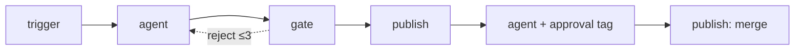

# Flow Capabilities and Limits — What You Can Build, and What You Can't

**Package:** `@helmsmith/flow-spec` · **Date:** 2026-08-13 · Companion docs: [`SPEC.md`](../SPEC.md) (contract detail) · [`steps-and-edges.md`](./steps-and-edges.md) (per-field authoring reference) · [`critical-feedback.md`](./critical-feedback.md) (open items with severity)

This is the *pattern-level* guide: which shapes of flow the contract + runtime actually support, and — just as deliberately — which they don't. Field-by-field detail lives in [`steps-and-edges.md`](./steps-and-edges.md); this document answers "can I build X?" before you reach for the field tables.

One rule makes this document trustworthy: **the spec never silently ignores config.** Everything below marked *works* is executed by the runtime and pinned by conformance fixtures; the two features that validate but don't execute (`js` expressions, subflow version pins) warn at load through the `onUnsupported` seam. If a catalog loads without warnings, it does everything it says.

---

## 1. The mental model

A flow is a **static DAG of typed steps** connected by **typed edges**, compiled once and executed as a graph. Three planes:

- **Routing plane** — edges decide where execution goes next: `sequence` (all fire — fan-out), `conditional` (first truthy predicate), `error` (matched by `errorName`), `fallback` (catchall), `reject` (the only edge allowed to form a cycle, budgeted by `maxAttempts`).
- **Data plane** — run state addressable from any Expression: `$.input` (the job payload, write-once), `$.nodes.<id>` (every prior node's output, parsed JSON when declared), `$.output` (legacy latest-string channel). Nodes compose their input from any of it via `input` mappings.
- **Control plane** — tags and policies wrap nodes without changing topology: `approval`/`suspend` pause the job durably; `loop` iterates a node over items; `policy` adds retry/timeout/error disposition; `effect` classifies replay safety.



---

## 2. Flow shapes that work

### 2.1 Linear pipelines
The base case: trigger → agent → agent → publish, each step consuming the previous output as its prompt/stdin. No configuration beyond the nodes and sequence edges.

### 2.2 Structured handoffs (multi-input nodes)
Declare `"output": { "kind": "json" }` on a producing node and its parsed result becomes addressable at `$.nodes.<id>`; any later node composes its input from several sources at once:

```json
{ "id": "fix", "kind": "agent",
  "input": { "task":   { "kind": "jsonpath", "path": "$.input" },
             "review": { "kind": "jsonpath", "path": "$.nodes.review" } }, ... }
```

This is how a fixer sees both the original task and the reviewer's findings — no more single-string relay. Output can additionally declare a `schema` (enforced JSON-Schema subset): violations exit `OutputSchemaViolation`, routable and retryable.

### 2.3 Branching on results
Conditional edges evaluate Expressions against run state — `compare` (11 ops incl. string/regex), `exists` (presence ≠ truthiness), `all`/`any`/`not` composition. Typical: route on `$.nodes.review.score > 0.8`. First truthy condition in declaration order wins; a `fallback` edge catches the none-matched case.

### 2.4 Quality gates with bounded retry cycles
A `gate` node asserts on state; failure exits via the `reject` edge — the **only** cycle-permitted edge — carrying a structured `RejectionPayload` (reason, findings, attempt counter) back to the producing node. `maxAttempts` bounds the loop; `onMaxAttempts` picks fail or escalate. This is the retry-with-context pattern: the re-run agent sees *why* it was rejected.

### 2.5 Resilience — when an LLM call (or anything else) fails
Four stacked layers, innermost first:

1. **Accept-list fallback (within one node execution).** An agent with `accepts: ["anthropic:claude-opus-4-7", "local-qwen:qwen3"]` falls through to the next binding when the adapter throws one of its `fallbackOn` error classes — default `BillingError` / `RateLimitError` / `NetworkError` / `ProviderError`. `AuthError`/`ConfigError` deliberately do **not** fall through (a revoked key should page an operator, not silently switch providers).
2. **`policy.retry` + `policy.timeout` (around the whole node).** `maxAttempts` total attempts with fixed/exponential backoff on *error* exits. `timeout` converts a hung attempt into a routable `Timeout` error. Rejects are authored flow control and never auto-retried.

   **Shape failures are first-class here.** A node declaring `output.kind: 'json'` that emits unparseable output exits `OutputParseError`; one whose parsed output violates its declared `schema` exits `OutputSchemaViolation` (and the bad value is *not* recorded as evidence at `$.nodes.<id>`). Both are ordinary error exits — `policy.retry` re-asks the agent, and error edges can route them. Note the retry is **blind**: the agent re-runs with the same input, not told what was wrong. When the reattempt should *see the failure*, use the gate + reject pattern instead — assert on the parsed fields and let the `RejectionPayload` carry the findings back into the producer's next attempt (§2.4). Rule of thumb: `policy.retry` for transient/format flakiness, `gate` + `reject` for correctable-with-feedback quality.
3. **Typed error edges (across the graph).** Route by `errorName`: `on: ["Timeout"]` to one handler, `RateLimitError` to another, one catch-all last. Unmatched errors fail the flow loudly — `policy.onError` can instead `continue` (log and proceed) or route to the `fallback` edge.
4. **Replay safety (`effect`).** A `side-effecting` node that already completed is skipped on re-entry with its recorded output restored — a reject cycle or restart replay never opens a duplicate PR. Publish executors are additionally idempotent by natural key.

Durability underneath all of it: paused/suspended jobs persist through the checkpointer and survive process restarts, including SLA and wake timers (re-armed from the original pause time).

### 2.6 Parallel fan-out and joins
Every `sequence` edge from a node fires — N edges = N parallel branches. A node declaring `joinStrategy` (`all` / `any` / `{nOfM}`) is a barrier over its forward-edge sources, firing exactly once per run. The validator statically rejects joins that could wedge: one requiring more sources than are guaranteed to run on every execution path (a must-reach analysis — exhaustive branching that reconverges still validates), and one inside a reject cycle (the barrier never resets across retries). Branch outputs stay addressable at the join via `$.nodes.<id>` (never rely on `$.output` across branches — it is last-write-wins and nondeterministic).

### 2.7 Human-in-the-loop
- **`approval` tag**: pauses the job (`awaiting-approval`) with the node's output as review content; `slaMs` arms a server-side auto-reject timer; `assigneeRole` gates the resume route; reject can carry operator steering back into the retry cycle. The tagged node's work runs exactly once — resume never re-invokes the LLM.
- **`suspend` tag**: pause-and-wake — timer (`durationMs`) or event (`eventType` + optional matcher against the event envelope).
- Both survive restarts, and since subflow v2 both work **inside subflows** at any depth — an inner pause pauses the parent job through the same machinery.

### 2.8 Batch work (loops)
`loop` tag iterates one node over a collection (any Expression resolving to an array) or a directory (optionally `recursive`, files only). `parallel` mode runs a per-slot pool with sibling cancellation on first failure; with `output.kind: 'json'` iterations aggregate a JSON array. Per-iteration state deltas accumulate across iterations.

### 2.9 Composition (subflows)
`subflow` nodes invoke another flow in the catalog; output flows back, `changedFiles`/`steering` merge up. Since v2, inner flows may contain **agents** (same adapter/fallback pipeline as parent agents) and **approval/suspend tags** (pauses propagate to the parent, multi-pause and nested pauses resume in order). Shared library flows compose freely; cycles across references are rejected at compile time.

### 2.10 Triggered flows
Five trigger kinds, all live: `manual` (`POST /v1/jobs`), `webhook` (`/v1/hooks/<path>`), `schedule` (cron subset, server-local time), `event` (`POST /v1/events` with matcher — the same event can wake suspended jobs *and* start flows), `message` (`POST /v1/messages`, conversational intake). Trigger-fired jobs carry `triggeredBy` provenance.

### 2.11 Factory flows (work orders)
A flow with `kind: 'job-definition'` must declare `output: { kind: 'job-intent' }`; the terminal output is shape-enforced and, on success, **spawns the child job** through the dispatcher with two-way lineage (`parentJobId`/`spawnedJobIds`). `job-intents` (plural, with `min`/`max`) fans out N child jobs from one flow — this is how a flow's *result* scales work without the graph itself being dynamic.

### 2.12 Authored failure endpoints
A sink node with `terminal: 'fail'` fails the whole job when a branch ends there — e.g. an error edge routing to a notify-then-fail step. Success terminals enforce the flow's declared output contract (`agent-text` / `job-intent(s)` / `flow-spec` / `structured` with schema).

---

## 3. What you can't build

### 3.1 Deliberate design positions (not coming back)

| You can't… | Because | Instead |
|---|---|---|
| Evaluate JavaScript in expressions (`kind: 'js'` throws; warned as `expression-js`) | No sandbox dependency; most routing logic is field comparison + boolean composition | Compose `compare`/`all`/`any`/`not`/`exists`; use a `script` step when you genuinely need code |
| Write unbounded loops / `while` semantics | Only `reject` edges cycle, and they carry a `maxAttempts` budget — every flow provably terminates | Bounded reject cycles; `loop` tag for data-driven iteration; a `schedule` trigger for "run forever, periodically" |
| Mutate topology at runtime (add nodes/edges mid-run, data-driven step creation) | The graph compiles once from the static FlowDef — that's what makes it validatable, diffable, and designable | Scale at the *job* level: `job-intents` fan-out spawns N child jobs; `loop` iterates a node over N items |
| Declare more than one trigger per flow | One entry point per graph keeps routing decidable | One flow per trigger; shared logic in a common `subflow` |
| Ship layout / UI state in the wire contract | FlowDef is runtime contract only | The designer persists layout as a browser-local sidecar |
| Put secrets in catalogs | Catalogs are reviewable artifacts | Everything is a `credentialId` reference resolved through the CredentialBroker at dispatch |

### 3.2 Current limitations (ledger-tracked; may change)

| Limitation | Detail |
|---|---|
| Subflow `version` pin is recorded, not enforced | Resolution stays by `flowId` (warned as `subflow-version-pin`) |
| Loop-tagged subflow node over an interrupt-bearing inner tree | Compile-rejected — iterations would share one pause namespace. Move the HITL gate out of the loop |
| Duplicate agent ids across a subflow tree | Compile-rejected — the RegisteredAgent list is flat |
| Approval `concurrency: 'pessimistic'` | Validates but no lock exists — two same-role reviewers can race; last decision wins via the status guard |
| Cron subset | No timezones (`tz` rejected at load), no month/day names, no `a-b/n` range-steps — server-local time, 5 fields |
| `==` on objects is reference equality | Structurally equal objects are never `==` — compare leaf fields |
| Input-mapping keys can't be named `kind` | That key marks the single-Expression form |
| `$.output` across parallel branches | Last-write-wins, nondeterministic — consume specific branches via `$.nodes.<id>` |
| Transform of a missing value | Resolving `undefined` writes the literal string `"undefined"` — guard with `exists` |
| `message` trigger is one-way | Inbound text spawns a job; replying is the relay's job (it watches the spawned job) |
| Input delivery is stringly | Mappings resolve structured values, then serialize through the one string channel; structured consumers re-parse |
| Scripts are batch-only | stdin→stdout, 10MB cap, no streaming; trusted admin-curated content only |

### 3.3 Out of scope (other layers own it)

- **Agent quality** — prompts, model choice trade-offs, skill content. The spec carries `systemPrompt`/`accepts`/`skillz` as data; making them good is authoring work.
- **The adapter registry** — the spec validates `adapter` as a string; existence is enforced at spawn time by the runtime's factory (that IS the registry).
- **Cross-job orchestration state** — flows don't share memory; the seam between jobs is the `JobIntent` (factory/fleet model). Deliberative multi-agent reasoning lives in the worker fleet, not the flow graph.
- **Write-time catalog storage/authz** — the controlplane's job, against the generated `schema/flow-spec.schema.json`.

---

## 4. Decision table

| I want to… | Reach for |
|---|---|
| Branch on an agent's answer | `output.kind: 'json'` on the agent + `conditional` edge over `$.nodes.<id>.field` |
| Retry an agent that emitted bad JSON | `policy.retry` (covers `OutputParseError`) |
| Enforce a typed output shape, reattempt on violation | `output: { kind: 'json', schema }` (violations exit `OutputSchemaViolation`) + `policy.retry`; add a `gate` + `reject` when the reattempt should see the findings |
| Survive a provider outage mid-flow | `accepts` list (billing/rate-limit/network fall through automatically) |
| Catch timeouts differently from auth failures | `policy.timeout` + `error` edges with `on: ["Timeout"]` / `on: ["AuthError"]` |
| Enforce quality before shipping | `gate` + `reject` edge back to the producer (`maxAttempts`, `onMaxAttempts`) |
| Require human sign-off | `approval` tag (`slaMs`, `assigneeRole`); put `merge-pr` after it |
| Wait for an external system | `suspend` tag with an `event` trigger; the system POSTs `/v1/events` |
| Wait a fixed time | `suspend` tag with a `timer` trigger |
| Process every file in a repo | `loop` tag, `source: 'directory'`, `recursive: true` |
| Run branches concurrently and merge | Multiple `sequence` edges + a `joinStrategy: 'all'` node consuming `$.nodes.<id>` |
| Reuse a step sequence across flows | `subflow` (agents + HITL gates allowed inside since v2) |
| Spawn N follow-up jobs from one conversation | `kind: 'job-definition'` flow with `output.kind: 'job-intents'` |
| Run nightly | `schedule` trigger (cron subset, server-local) |
| Start flows from chat | `message` trigger + a relay posting `/v1/messages` |
| Never double-post a PR on retry | `effect: 'side-effecting'` (at-most-once) or `'idempotent'` (reuse-by-natural-key) |
| Fail loudly after notifying someone | error edge → notify step → sink with `terminal: 'fail'` |

---

## 5. Where to go next

- Field-level detail and JSON examples for everything above: [`steps-and-edges.md`](./steps-and-edges.md)
- Exact contract semantics and the validator's full rule list: [`SPEC.md`](../SPEC.md)
- What's still open, with severity: [`critical-feedback.md`](./critical-feedback.md) §2–3
- The language-neutral schema artifact for non-TypeScript consumers: `schema/flow-spec.schema.json`
