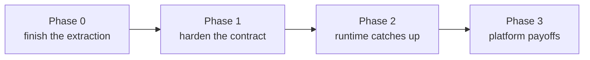

# Flow Spec — Suggested Next Steps

**Date:** 2026-08-07 · **Updated:** 2026-08-12 · Companion docs: [`SPEC.md`](../SPEC.md) · [`steps-and-edges.md`](./steps-and-edges.md) · [`critical-feedback.md`](./critical-feedback.md)

A sequenced roadmap merging the original review's recommendations with the package-level items, minus what's already done (honesty seam, semantics pinning, extraction itself; **2026-08-12:** the data-plane slice — `FlowRunState` + `$.input`/`$.nodes` channels, node `input` mappings, `output.kind: 'json'` parsing, error-edge `on` matchers, expression additions (`exists`/`object`/`array`/string ops), script `secrets`, flow/subflow `version`, run-side wire shapes, and item 0.3 below). Effort: **S** ≤ half a day · **M** 1–3 days · **L** a real slice.

---

## Phase 0 — Finish the extraction (candidates for PR #13 or immediate follow-up)

| # | Item | Effort | Why now |
|---|---|---|---|
| 0.1 | ~~**Curate the export surface** — named exports in flow-spec's `index.ts` and harness-core's `catalog.ts` re-export; decide `ToolResolver`/`walkAgents`/`resolveAccepts` placement while at it~~ | S | ✅ Done 2026-08-12 (export-surface slice): named exports at both layers; `ToolResolver` moved to harness-core's `tool-executor.ts`; `walkAgents`/`resolveAccepts` stay as pure spec helpers; fixtures not re-exported by `catalog.ts` (see critical-feedback §1.5) |
| 0.2 | ~~**Narrow `scanForJsExpressions` to known expression positions** (edge conditions, gate assertions, transform expressions, loop paths, matchers, tool args)~~ | S | ✅ Done 2026-08-12 (export-surface slice): position-aware walk mirroring the runtime's expression positions incl. top-level-only tool args / subflow inputs; inert-data false positives pinned dead by two new `UNSUPPORTED_CASES` fixtures |
| 0.3 | ~~**Add the `test` script** to flow-spec's package.json~~ | S | ✅ Done 2026-08-12 (data-plane slice) |
| 0.4 | ~~**Validator-consistency fixes** — load-time jsonpath path-syntax check, shadowed error-edge name rejection, `job-intents` min ≤ max cross-check, `vitest` in devDependencies~~ | S | ✅ Done 2026-08-12 (validator-consistency pass): all three validator rules pinned by new `VALIDATION_CASES` fixtures, replayed by both packages (see critical-feedback §1.4) |

## Phase 1 — Harden the contract (before any second consumer)

| # | Item | Effort | Why |
|---|---|---|---|
| 1.1 | ~~**Validation-verdict + unsupported-feature fixtures**~~ | M | ✅ Done 2026-08-12 (hardening slice): `VALIDATION_CASES` + `UNSUPPORTED_CASES` replayed by both packages with exact-set feature matching |
| 1.2 | **Generate JSON Schema from the types** as a build artifact of this package | M | The controlplane Phase 2 validator and the smithagents work-order seam both need a language-neutral contract; hand-porting rules to Java is the drift machine the review warned about |
| 1.3 | **Wire changesets + drop `private` when the first out-of-repo consumer appears** | S | Semver discipline was a stated reason to extract; set it up before someone needs a version to pin |

## Phase 2 — Runtime catches up to the spec (each item deletes a warning)

Ordered by risk-reduction per effort. The rule from the README applies to every row: the change that implements a feature deletes its `onUnsupported` report — and after 1.1, forgetting that fails CI.

| # | Item | Effort | Notes |
|---|---|---|---|
| 2.1 | ~~**Approval hardening: `slaMs` auto-reject timer + role check on the resume route**~~ | M | ✅ Done 2026-08-12 (HITL trust slice): per-approval SLA timer (re-armed across restarts from the original pause time) + `x-actor-role` gate + `decision` body validation. Pessimistic locking remains open (critical-feedback §3) |
| 2.2 | ~~**Durable checkpointer by default** (SQLite file per workspace; PG in production)~~ | M | ✅ Done 2026-08-12 (HITL trust slice): SqliteSaver default + `RunJobDeps.checkpointer` seam + paused-job JSON rehydration + recompile-on-resume; PG is a config swap through the same seam |
| 2.3 | ~~**`policy.retry` (+ backoff), then `policy.timeout`, then `onError`**~~ | M | ✅ Done 2026-08-12 (policy slice): `withPolicy` wrapper — retry (total attempts, fixed/exponential backoff, covers `OutputParseError`), per-attempt `timeout` → routable `'Timeout'` exit, `onError` continue/fallback/propagate; `policy` report deleted fixture-first |
| 2.4 | **Decide parallelism** — either implement fan-out/join (LangGraph supports multi-target routing; `joinStrategy` becomes real) or delete `joinStrategy` and validate ≤1 sequence edge | L / S | The half-state is the worst state. **2026-08-12 note: the state-model prerequisite now exists** — `nodes` is merge-reduced and `output` is documented as legacy, so branches can no longer clobber each other's addressable outputs; what remains is genuinely just the router/join work |
| 2.5 | ~~**Enforce output contracts at the terminal node**~~ | M | ✅ Done 2026-08-12 (hardening slice): `parseFlowOutput` + `finalizeOrPause` enforcement + `job.flowOutput`. Remaining: `structured.schema` (see 2.7's schema decision) and JobIntent *emission* (submitting `job.flowOutput` to the JobStateMachine — new row 2.9) |
| 2.9 | **JobIntent emission** — submit the enforced-and-recorded `job.flowOutput` intent(s) from `job-definition` flows to the JobStateMachine to launch the actual work flow | M | The other half of the factory/fleet seam: 2.5 guarantees the work order is well-formed; this makes it DO something |
| 2.6 | **Suspend wake-up scheduling** (timer via job queue; event via bus subscription) | M | Makes `suspend` a real durability primitive instead of a pause-forever |
| 2.7 | **Enforce `node-output-schema`** — validate declared schemas against parsed node output (needs a browser-safe JSON-Schema subset or a generated-validator approach; zero-dep constraint applies) | M | Deletes the `node-output-schema` report; turns agent output contracts from parse-only into shape-checked |
| 2.8 | ~~**Consult `effect` on replay/retry** — skip re-running `side-effecting` nodes on checkpointer replay; require idempotency keys for publish~~ | M | ✅ Done 2026-08-12 (HITL trust slice, landed BEFORE 2.2 per the constraint): `withEffectGuard` gives side-effecting nodes at-most-once semantics; publish executors idempotent by natural key (head branch / mergeSha); `effect` report deleted fixture-first |

## Phase 3 — Platform payoffs (the reasons the package exists)

| # | Item | Effort | Depends on |
|---|---|---|---|
| 3.1 | **Trigger ingress** — scheduler (cron), webhook route, event-bus subscription; or formally demote triggers to manual-only and delete the other four kinds | L | 2.6's scheduler machinery overlaps |
| 3.2 | **Flow designer UI** consuming flow-spec directly in the browser (types + validation + expression preview against the same evaluator the router uses) | L | 0.1 (clean surface), 1.1 (fixtures to test the preview against) |
| 3.3 | **Controlplane Phase 2 validation** via the generated schema — reject bad flows at write time instead of first-load time | M | 1.2 |
| 3.4 | **Loosen `AdapterId` to a registry-checked string** | S | Do it in the same change that adds the third adapter — don't pay the spec-change tax twice |
| 3.5 | **Loop v2** — cross-iteration state accumulation, per-slot parallelism with sibling cancellation (needs `AbortSignal` in the `NodeExecutor` contract), recursive directory source | L | Independent |

## Suggested immediate sequence

1. Land PR #13 as-is (extraction + honesty + pinned semantics are a complete, reviewable unit).
2. Phase 0 as one small follow-up PR (0.1–0.3 together: surface curation + scan precision + test script).
3. Phase 1.1 next — it's the multiplier: every later phase-2 item then proves itself against conformance instead of convention.
4. Then 2.1 + 2.2 together as the "HITL you can trust" slice — they share the pause/resume surface and jointly make approval production-grade.
