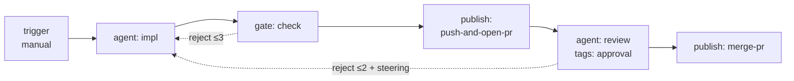

# Flow Authoring Reference — Steps, Edges, Tags, and What Actually Runs

**Package:** `@helmsmith/flow-spec` · **Date:** 2026-08-07 · **Updated:** 2026-08-12 (data plane: node I/O, error matchers, expression additions; validator-consistency pass: load-time path syntax, shadow rejection, min ≤ max) · Companion docs: [`SPEC.md`](../SPEC.md) (contract detail) · [`capabilities-and-limits.md`](./capabilities-and-limits.md) (pattern-level: what you can build) · [`critical-feedback.md`](./critical-feedback.md) · [`next-steps.md`](./next-steps.md)

This is the catalog author's reference: every node kind, edge type, and tag — with its config fields, a working JSON example, and an honest **support status**. Status comes from the runtime as it exists today; anything marked ❌ still *validates* but triggers a load-time warning via the `onUnsupported` seam and then does nothing.

**Legend:** ✅ executed by the runtime · ⚠️ executed with caveats · ❌ validated only — accepted, warned at load, ignored at runtime

---

## 1. Anatomy of a flow

```json
{
  "id": "review-and-ship",
  "description": "Implement, gate, ship as PR, human-approve, merge.",
  "kind": "work",
  "nodes": [
    { "id": "start",  "kind": "trigger",  "config": { "kind": "manual" } },
    { "id": "impl",   "kind": "agent",    "config": { "agent": { "id": "impl", "role": "Implementer", "adapter": "claude-sdk",
                        "accepts": ["anthropic:claude-opus-4-7", "local-qwen:qwen3"] } } },
    { "id": "check",  "kind": "gate",     "config": { "assertions": [
                        { "expression": { "kind": "jsonpath", "path": "$.output" }, "message": "implementation produced no output" } ] } },
    { "id": "ship",   "kind": "publish",  "config": { "action": "push-and-open-pr", "draft": true } },
    { "id": "review", "kind": "agent",    "config": { "agent": { "id": "review", "role": "Summarizer", "adapter": "claude-sdk" } },
                      "tags": { "approval": { "assigneeRole": "tech-lead", "slaMs": 86400000, "concurrency": "pessimistic" } } },
    { "id": "merge",  "kind": "publish",  "config": { "action": "merge-pr", "method": "squash" } }
  ],
  "edges": [
    { "from": "start",  "to": "impl",   "type": "sequence" },
    { "from": "impl",   "to": "check",  "type": "sequence" },
    { "from": "check",  "to": "ship",   "type": "sequence" },
    { "from": "check",  "to": "impl",   "type": "reject", "maxAttempts": 3 },
    { "from": "ship",   "to": "review", "type": "sequence" },
    { "from": "review", "to": "merge",  "type": "sequence" },
    { "from": "review", "to": "impl",   "type": "reject", "maxAttempts": 2, "onMaxAttempts": { "kind": "fail" } }
  ]
}
```



Rules that shape every flow: exactly one `trigger` node (no incoming edges, ≥1 outgoing); node ids unique; every edge endpoint must exist; terminal nodes are simply nodes with no outgoing edges; only `reject` edges may form cycles — everything else must be a DAG.

---

## 2. Step kinds

### 2.1 `trigger` — entry point · every kind fires ✅

| Config | Fields | Status |
|---|---|---|
| `{ "kind": "manual" }` | — | ✅ jobs start via `POST /v1/jobs` |
| `{ "kind": "webhook" }` | `path` (required), `method?` GET\|POST (default POST) | ✅ fires via `POST\|GET /v1/hooks/<path>`; job input = `{trigger, path, method, payload}` (POST body / GET query) |
| `{ "kind": "schedule" }` | `cron` (required; subset grammar, load-time validated), `tz?` | ✅ server-local cron scheduler, armed at boot, re-armed per fire, `GET /v1/triggers` shows next fire. **`tz` is rejected at load** — schedules run in server-local time until tz support lands |
| `{ "kind": "event" }` | `eventType` (required), `matcher?` Expression | ✅ fires via `POST /v1/events {type, payload}` — the matcher evaluates against that envelope (same semantics as suspend wakes; one event can wake suspends AND start flows). Job input = the envelope |
| `{ "kind": "message" }` | `channel` (required) | ✅ fires via `POST /v1/messages {channel, text, from?}` — the conversational-intake ingress (a Slack/Discord/controlplane relay posts inbound messages). Job input = the message TEXT (the prompt), not an envelope; one-way in v1 (the relay watches the spawned job) |

Inside the graph a trigger stays an inert entry marker that immediately succeeds; the kinds above govern what *starts* the job. Trigger-fired jobs carry `triggeredBy` provenance (`webhook:<path>` / `event:<type>` / `schedule:<cron>` / `message:<channel>`). Cron subset: 5 fields; `*`, `*/n`, comma lists of numbers and `a-b` ranges; dow `0-7` (7 ≡ Sunday); restricted dom+dow use standard OR semantics.

### 2.2 `agent` — LLM work ✅

Config is `{ "agent": AgentDef }`:

| Field | Type | Required | Notes |
|---|---|---|---|
| `id` | string | yes | Unique within the flow; used for streaming/registration |
| `role` | string | yes | Human-readable label (TUI, logs) |
| `adapter` | string (registry id) | yes | Resolved at runtime by the adapter factory (3.4); the default registry ships `claude-sdk` and `opencode-cli`, and an unknown id fails at spawn time with the known-ids list |
| `systemPrompt` | string | no | Adapter default applies when omitted |
| `config` | object | no | Adapter-specific overrides (model, endpoint, effort…) |
| `accepts` | `string[]` \| `{ [set]: string[] }` | no | Priority-ordered `provider:model` bindings; named sets selected per-job via `set`; falls back to `default` |
| `fallbackOn` | string[] | no | AdapterError subclass names that trigger fall-through to the next binding. Default: Billing/RateLimit/Network/Provider (not Auth/Config — those page an operator) |
| `skillz` | `{ routers?, tools?, integrations?, tasks?, workflows? }` | no | Skill dependencies procured into the agent's workspace |

Runtime behavior: prior node's `output` becomes the prompt — unless the node declares an `input` mapping (§5), which composes the prompt from any run-state fields (`$.input`, `$.nodes.<id>`, …); operator steering is prepended to the system prompt; cooperative cancellation is checked at node-tick; staged file changes are discovered after each successful tick.

### 2.3 `tool` — deterministic call ✅

Config: `{ "toolId": string, "args"?: Record<string, unknown> }`. Arg values may be Expressions (`{"kind":"jsonpath","path":"$.output"}`) resolved against flow state. The `toolId` resolves server-side to a `ToolDef`:

| ToolDef kind | Key fields | Behavior |
|---|---|---|
| `cli` | `cmd`, `args?` (with `{{name}}` placeholders), `cwd?`, `env?`, `timeoutMs?` (30s), `allowExitCodes?` | `execFile`, no shell; stdout → `state.output`; non-allowed exit → error edge |
| `http` | `method`, `endpoint` (with `{{name}}`), `bodyTemplate?`, `headers?`, `auth?`, `timeoutMs?` (30s) | Response body → `state.output`; non-2xx → error edge |
| `mcp` | `server` (argv array or URL), `toolName`, `auth?`, `timeoutMs?` (60s) | Server spawned per call (no pooling in v1); result → `state.output` |

Auth is always a reference (`credentialId` + scheme) resolved through the CredentialBroker — never an inline secret. Unknown `toolId` → `errorName: 'UnknownTool'`, routable via error edge.

**Input-mechanism rule** (when the node also declares `input`): the two channels compose — **`input` composes the payload, `args` bind the tool's parameters**. The `input` mapping rewrites the effective `$.output` before the executor runs (it is the innermost node wrapper), then `args` expressions resolve against that post-mapping state — so `{"payload": {"kind":"jsonpath","path":"$.output"}}` binds the composed payload to a named parameter. A ToolDef's `{{name}}` templates interpolate against resolved args **only**, which makes an `input` mapping with no `$.output`-reading arg provably dead: the validator rejects it (`input mapping is dead config`). Only top-level arg values are expression-resolved (`literal`/`jsonpath`/`js`-shaped); nested shapes pass through as plain data.

### 2.4 `script` — inline subprocess ✅

Config: `{ "language": "bash"|"node"|"python", "source": string, "env"?, "secrets"?, "timeoutMs"? }` (30s default). `state.output` arrives on stdin; a curated state view (incl. `$.input`, excl. `nodes`/`messages`/`changedFiles` for env-size reasons) as JSON in `HARNESS_STATE_JSON` — scripts that need a specific node's output declare an `input` mapping, which arrives on stdin; stdout (10MB cap) becomes the new `state.output`; non-zero exit → error edge. Batch only — no streaming. Scripts are trusted admin-curated content; state is passed as data, never interpolated into commands.

`secrets` maps env var names to credential references — `{ "API_KEY": { "credentialId": "anthropic" } }` — resolved through the same CredentialBroker tools use and injected into the child env at dispatch time (winning over same-named static `env` entries). Unresolvable credential or missing broker → `errorName: 'AuthError'`, routable via error edge. Secrets never appear literally in catalogs.

### 2.5 `transform` — pure data shaping ✅

Config: `{ "expression": Expression }`. Writes the resolved value to `state.output` (strings pass through; everything else `JSON.stringify`d). Always succeeds. With the `object`/`array` constructor expressions this is real data shaping — build a structured value from several state fields, declare `"output": { "kind": "json" }` on the node, and the parsed result lands at `$.nodes.<id>` for downstream gates/edges. **Caveat:** an expression resolving to `undefined` writes the literal string `"undefined"` — guard with `exists` first if absence matters.

### 2.6 `gate` — quality gate ✅

Config: `{ "assertions": [{ "expression": Expression, "message": string }, …] }` (non-empty). All hold → success; any fail → reject exit with a `RejectionPayload` (`reason` = joined messages, `findings` = structured failures, `attempt` counter). Route the reject edge back to the producing node for retry-with-context loops.

### 2.7 `subflow` — composition ✅ (v2: agents + interrupts)

Config: `{ "flowId": string, "version"?: string, "input"?: Record<string, unknown> }` (input values are Expressions). Parent state passes through; inner output replaces parent `output`; `changedFiles`/`steering` merge back. `version` pins the target flow's `version` — recorded but **not enforced** (resolution stays by flowId; warned as `subflow-version-pin`).

**v2 composition:** inner flows may contain `agent` nodes (executed through the same adapter-dispatch/fallback/JobRecord pipeline as parent agents; registration recurses via `walkAgents(flow, resolver)`) and `approval`/`suspend` tags. An interrupt-bearing inner compiles as a subgraph sharing the parent's checkpointer (namespaced), so an inner pause **pauses the parent job** with the same request payload, persists durably, and resumes through the same resume route — multi-pause and nested-subflow pauses resume in order. **Remaining compile-time rejections:** a loop-tagged subflow node whose inner tree contains interrupt tags (iterations would share one pause namespace); duplicate agent ids across the subflow tree (the RegisteredAgent list is flat); cycles across subflow references.

### 2.8 `publish` — delivery ✅

| Action | Fields | Behavior |
|---|---|---|
| `push-and-open-pr` | `repo?` (required if product has >1), `title?`, `body?`, `base?`, `draft?` | Pushes the per-job branch, opens the PR, writes `{prUrl, prNumber, branchName}` to `state.output` + JobRecord |
| `merge-pr` | `method?` merge\|squash\|rebase (squash), `deleteBranch?` (true) | Merges the PR recorded on the JobRecord; writes `{mergeSha}` |

Credentials via the GitHub resolver cascade (local `gh` → controlplane App token). No resolver configured → `errorName: 'UnconfiguredGitHub'`, routable via error edge. Place `merge-pr` after an approval-tagged node so it only runs on the approve path.

---

## 3. Edges

| Type | Extra fields | Cardinality (per source) | Semantics | Status |
|---|---|---|---|---|
| `sequence` | — | unlimited — **every sequence edge fires** (parallel fan-out) | Default forward path; N>1 edges run their targets as parallel branches | ✅ |
| `conditional` | `condition: Expression` | unlimited | Tried in declaration order on success exit; first truthy predicate wins | ✅ |
| `fallback` | — | ≤ 1 | Catchall when no conditional matched and no sequence edge exists | ✅ |
| `error` | `on?: string[]` | any number with `on`; ≤ 1 catch-all (no/empty `on`); each error name at most once per source (a shadowed name is rejected at load — it could never fire) | Catches `error` exits. `on` matches `NodeExit.errorName` (`Timeout`, `RateLimitError`, `OutputParseError`, `UnknownTool`, `AuthError`, …) — first declared match wins, catch-all last; a name matched by no edge fails the flow | ✅ |
| `reject` | `maxAttempts?` (3), `onMaxAttempts?` `{kind:'fail'}` \| `{kind:'escalate', to}` | ≤ 1; may only originate from `gate` or approval-tagged nodes | The only cycle-permitted edge; carries `RejectionPayload`; attempts exceeded → fail (default) or escalate | ✅ |

Router precedence on every node exit: **reject → error → conditional (declaration order, first match) → sequence (ALL fire — fan-out) → fallback → END.**

Parallel split/join is real (2026-08-12): every sequence edge from a node fires its target as a parallel branch, and a node that explicitly declares `joinStrategy` is a barrier over its forward-edge sources — `all` waits for every source, `any` fires on the first arrival, `{nOfM: n}` on the nth, exactly once per run. Undeclared multi-in nodes run once per arriving branch (no implicit join — an implicit `all` would deadlock diamonds whose branches route conditionally). Joins may not be targeted by error/fallback/reject edges (validator-rejected). The two remaining wedge classes are now **statically rejected at load** (join-hazard analysis): a join requiring more sources than are *guaranteed to run* — a must-reach check over success routing, so exhaustive branching that reconverges still validates — and a join inside a reject cycle (the once-per-run barrier never resets across retries). Branch outputs stay addressable at the join via `$.nodes.<id>` (the `$.output` channel is last-write-wins and nondeterministic across branches — use input mappings).

---

## 4. Tags — behavioral modifiers

| Tag | Fields | Status | Caveats |
|---|---|---|---|
| `approval` | `assigneeRole`, `slaMs`, `steeringInputs?`, `concurrency: "pessimistic"` | ✅ | Interrupt/resume works end-to-end (pause → `awaiting-approval` → approve/reject with steering), and since the HITL trust slice (2026-08-12): `slaMs` arms a server-side auto-reject timer (re-armed across restarts from the original pause time), `assigneeRole` gates the resume route (`x-actor-role` header must match — header-asserted identity, real authn later), and paused jobs survive restarts (durable checkpointer + rehydration). Pessimistic locking (2026-08-13): `POST /v1/jobs/:id/approval/claim` takes an advisory-exclusive claim (`x-actor-id` + `x-actor-role`); once held, only the claimant may resume (409 otherwise), competing claims 409, `DELETE` releases (claimant only), claims persist with the paused job across restarts, and unclaimed approvals resume exactly as before. Mutually exclusive with `suspend`. |
| `suspend` | `trigger: {kind:'timer',durationMs}` \| `{kind:'event',eventType,matcher?}` | ✅ | Pauses AND wakes (2.6): timer triggers arm a server-side wake timer (re-armed across restarts from the original pause time — an expired-while-down timer fires immediately at boot); event triggers wake via `POST /v1/events {type, payload}` when `eventType` matches and the `matcher` (if any) passes against the event envelope `{ type, payload }`. Manual `POST /v1/jobs/:id/resume` still works. Suspended jobs survive restarts (durable checkpointer + rehydration). |
| `loop` | `source: "collection"\|"directory"`, `path: Expression`, `mode: "sequential"\|"parallel"`, `concurrency?` (4), `recursive?` (directory only) | ✅ | Iterates the node over items (item → `state.output`); outputs joined with `\n---\n` (a JSON array when `output.kind: 'json'`). **v2 (3.5):** per-iteration deltas ACCUMULATE across iterations (map channels merge, append channels concatenate); parallel mode is a per-slot pool — a slow item never stalls neighbors — with cooperative sibling cancellation on first failure (an `AbortSignal` reaches every inner run; outputs keep item order); `recursive: true` walks the directory tree and iterates files only. Still halts on the first error/reject. |

Approval/Suspend are implemented by a compile-time topology rewrite — the tagged node's work runs exactly once; a synthetic interrupt node owns the pause, so resume never re-invokes an LLM.

---

## 5. Node I/O — the data plane (`input` / `output` / `effect`)

Every node may declare three data-plane fields alongside `kind`/`config`:

| Field | Shape | Status | Semantics |
|---|---|---|---|
| `input` | Expression **or** `{ name: Expression, … }` | ✅ | Composes the node's effective input from run state instead of implicitly consuming the previous node's `output`. A single Expression resolves to its value (strings raw, everything else JSON); a Record resolves each field and delivers the object as JSON. Agents receive it as the prompt, scripts as stdin, tools/transforms/gates see it as `$.output`. On tool nodes the mapping must be consumed by an `$.output`-reading arg (see §2.3's input-mechanism rule) — otherwise rejected as dead config. Mapping keys must not be named `kind` (that marks the single-Expression form). |
| `output` | `{ "kind": "text" }` \| `{ "kind": "json", "schema"? }` | ✅ | `json` → the node's output string is parsed and recorded at `$.nodes.<id>` as structured data; invalid JSON exits with `errorName: 'OutputParseError'`. `schema` (2.7): declared schemas must use the enforced JSON-Schema subset (load-time gated — unsupported keywords like `oneOf` are rejected, never silently ignored) and the parsed output is checked against it — violations exit `errorName: 'OutputSchemaViolation'` (error-edge routable, retryable via `policy.retry`) and the value is not recorded as evidence. Subset: `type` (incl. `integer`, multi-type arrays), `properties`/`required`/`additionalProperties` (boolean), `items`, `enum`/`const`, min/max bounds, `pattern`. Combined with `tags.loop`, iterations aggregate a JSON **array**; each item must itself be valid JSON. Text evidence recorded at `$.nodes.<id>` is capped (default 256K chars, `…[truncated N chars]` marker; configurable via `CompileFlowOptions.maxTextEvidenceLength`) — the `$.output` relay and JSON evidence are never truncated. |
| `effect` | `"pure"` \| `"idempotent"` \| `"side-effecting"` | ✅ | Replay/retry safety classification, consulted on node re-entry: a `side-effecting` node with completion evidence at `$.nodes.<id>` is **skipped** (at-most-once) and its recorded output restored — this covers reject-edge cycles and checkpointer replays after resume/restart. `idempotent`/`pure`/unset re-run freely; mark publish nodes `idempotent` if re-publishing after fixes is intended (the executor reuses an existing PR for the same branch). |
| `policy` | `retry?: { maxAttempts, backoff?: fixed\|exponential }`, `timeout?: ms`, `onError?: "propagate"\|"continue"\|"fallback"` | ✅ | Reliability wrapper around the whole node (loop included). `retry` re-runs on ERROR exits up to `maxAttempts` **total** attempts (1 ≡ no retry) with backoff between attempts — retries also cover `OutputParseError` (re-ask the agent that emitted bad JSON); reject exits are authored flow control, never retried. `timeout` is a per-attempt deadline exiting `errorName: 'Timeout'` (error-edge routable, retryable; the hung executor keeps running detached — no AbortSignal yet). `onError` applies after retries exhaust: `continue` converts to success and proceeds, `fallback` routes to the node's fallback edge, `propagate` (default) fails the flow. A side-effecting node that already completed skips before any of this (see `effect`). |

**The run-state surface** (`FlowRunState` in types.ts) every Expression binds against:

| Path | Contents |
|---|---|
| `$.input` | The job/trigger payload. Seeded once; nodes can never overwrite it |
| `$.nodes.<id>` | Every prior node's output — parsed JSON when the node declared `output.kind: 'json'`, raw string otherwise |
| `$.output` | Legacy single channel: the latest node's output string |
| `$.lastExit` / `$.rejectionPayload` / `$.attempts` | Routing bookkeeping (errorName, reject context, retry counters) |
| `$.steering` / `$.changedFiles` / `$.cancelRequested` | Operator + review surfaces. `changedFiles` holds the latest FULL staged-changes snapshot — reverted files drop off (snapshot-replace semantics since 2026-08-13) |

Typical pattern — agent emits structured JSON, gate asserts on a field, a later agent consumes both the original task and the review:

```json
{ "id": "review", "kind": "agent", "output": { "kind": "json" },
  "config": { "agent": { "id": "review", "role": "Reviewer", "adapter": "claude-sdk",
    "systemPrompt": "Respond ONLY with JSON: {\"score\": <0..1>, \"notes\": \"...\"}" } } },
{ "id": "check", "kind": "gate", "config": { "assertions": [
  { "expression": { "kind": "compare",
      "lhs": { "kind": "jsonpath", "path": "$.nodes.review.score" },
      "op": ">", "rhs": { "kind": "literal", "value": 0.8 } },
    "message": "review score must exceed 0.8" } ] } },
{ "id": "fix", "kind": "agent",
  "input": { "task": { "kind": "jsonpath", "path": "$.input" },
             "review": { "kind": "jsonpath", "path": "$.nodes.review" } },
  "config": { "agent": { "id": "fix", "role": "Fixer", "adapter": "claude-sdk" } } }
```

---

## 6. Node fields that validate but do nothing ❌

| Field | What authors expect | What actually happens | Warning id |
|---|---|---|---|
| `config.version` (subflow) | Version-pinned resolution | Resolution by flowId only | `subflow-version-pin` |

---

## 7. Expression quick reference

Used by: conditional edges, gate assertions, transforms, loop paths, tool args, subflow inputs, event matchers, node `input` mappings. All ✅ except `js` ❌ (throws; warned as `expression-js` at load). Semantics are pinned by 28 conformance fixtures replayed by both the spec and the runtime (cases with `expectedValue` also pin value semantics).

| Kind | Shape | Pinned semantics |
|---|---|---|
| `literal` | `{kind, value}` | Truthiness as predicate; raw value otherwise |
| `jsonpath` | `{kind, path}` | `$`, `$.a.b`, dot-numeric array index `$.arr.0`; miss/out-of-bounds → `undefined`; no brackets/wildcards/filters. Malformed paths (no `$` prefix, empty segments) rejected at load time. Binds against `FlowRunState` (§5) |
| `compare` | `{kind, lhs, op, rhs}` | `==`/`!=` strict (objects by reference); `<` `<=` `>` `>=` via `Number()`, NaN ⇒ false; `in` = array membership via SameValueZero; `contains`/`startsWith`/`endsWith` string-only (non-string ⇒ false); `matches` = `new RegExp(rhs).test(lhs)`, invalid pattern ⇒ false (literal patterns rejected at load) |
| `all` / `any` | `{kind, exprs[]}` | Short-circuit AND/OR; `all([])`=true, `any([])`=false |
| `not` | `{kind, expr}` | Inversion |
| `exists` | `{kind, expr}` | Presence, not truthiness: only `undefined` (missing path) is false — `null`/`false`/`0`/`""` all exist |
| `object` | `{kind, fields: {name: Expr}}` | Constructor — fields resolved against state; always true as predicate |
| `array` | `{kind, items: Expr[]}` | Constructor — items resolved against state; always true as predicate |
| `js` | `{kind, expression}` | **Throws** — compose the primitives instead |

---

## 8. Flow kinds and output contracts

| `FlowDef.kind` | Purpose | Output rule |
|---|---|---|
| `work` (default) | Product work | `output` defaults to `{kind:'agent-text'}` |
| `job-definition` | Intake conversation emitting a work order | **Must** declare `{kind:'job-intent'}` (statically enforced) |
| `post-job` | Cleanup / notifications | — |

`FlowOutputContract` kinds: `agent-text`, `job-intent`, `job-intents` (`min?`/`max?`, min ≤ max enforced at load), `flow-spec`, `structured` (`schema` required). **Enforced at the terminal** (`parseFlowOutput`): job-intent(s) shape-checked (flowId/productId/input, min/max), flow-spec emissions re-validated through the catalog validator, structured must parse as JSON **and** conform to its declared subset schema (2.7 — violations fail the job with located messages); a violation fails the job, success records the parsed value on `JobRecord.flowOutput`. Completed `job-intent`/`job-intents` flows then **emit** (2.9): harness-server spawns one child job per intent through its dispatcher — lineage on both records (`parentJobId`/`spawnedJobIds`), unspawnable intents on `parent.spawnErrors`.
