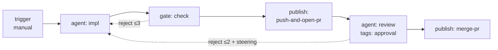

# Flow Authoring Reference — Steps, Edges, Tags, and What Actually Runs

**Package:** `@helmsmith/flow-spec` · **Date:** 2026-08-07 · Companion docs: [`SPEC.md`](../SPEC.md) (contract detail) · [`critical-feedback.md`](./critical-feedback.md) · [`next-steps.md`](./next-steps.md)

This is the catalog author's reference: every node kind, edge type, and tag — with its config fields, a working JSON example, and an honest **support status**. Status comes from the runtime as it exists today; anything marked ❌ still *validates* but triggers a load-time warning via the `onUnsupported` seam and then does nothing.

**Legend:** ✅ executed by the runtime · ⚠️ executed with caveats · ❌ validated only — accepted, warned at load, ignored at runtime

---

## 1. Anatomy of a flow

```json
{
  "id": "review-and-ship",
  "description": "Implement, gate, ship as PR, human-approve, merge.",
  "kind": "work",
  "nodes": [
    { "id": "start",  "kind": "trigger",  "config": { "kind": "manual" } },
    { "id": "impl",   "kind": "agent",    "config": { "agent": { "id": "impl", "role": "Implementer", "adapter": "claude-sdk",
                        "accepts": ["anthropic:claude-opus-4-7", "local-qwen:qwen3"] } } },
    { "id": "check",  "kind": "gate",     "config": { "assertions": [
                        { "expression": { "kind": "jsonpath", "path": "$.output" }, "message": "implementation produced no output" } ] } },
    { "id": "ship",   "kind": "publish",  "config": { "action": "push-and-open-pr", "draft": true } },
    { "id": "review", "kind": "agent",    "config": { "agent": { "id": "review", "role": "Summarizer", "adapter": "claude-sdk" } },
                      "tags": { "approval": { "assigneeRole": "tech-lead", "slaMs": 86400000, "concurrency": "pessimistic" } } },
    { "id": "merge",  "kind": "publish",  "config": { "action": "merge-pr", "method": "squash" } }
  ],
  "edges": [
    { "from": "start",  "to": "impl",   "type": "sequence" },
    { "from": "impl",   "to": "check",  "type": "sequence" },
    { "from": "check",  "to": "ship",   "type": "sequence" },
    { "from": "check",  "to": "impl",   "type": "reject", "maxAttempts": 3 },
    { "from": "ship",   "to": "review", "type": "sequence" },
    { "from": "review", "to": "merge",  "type": "sequence" },
    { "from": "review", "to": "impl",   "type": "reject", "maxAttempts": 2, "onMaxAttempts": { "kind": "fail" } }
  ]
}
```



Rules that shape every flow: exactly one `trigger` node (no incoming edges, ≥1 outgoing); node ids unique; every edge endpoint must exist; terminal nodes are simply nodes with no outgoing edges; only `reject` edges may form cycles — everything else must be a DAG.

---

## 2. Step kinds

### 2.1 `trigger` — entry point · manual ✅, everything else ❌

| Config | Fields | Status |
|---|---|---|
| `{ "kind": "manual" }` | — | ✅ the only trigger that means anything: jobs start via `POST /v1/jobs` |
| `{ "kind": "webhook" }` | `path` (required), `method?` GET\|POST | ❌ no HTTP ingress exists |
| `{ "kind": "schedule" }` | `cron` (required), `tz?` | ❌ no scheduler exists |
| `{ "kind": "event" }` | `eventType` (required), `matcher?` Expression | ❌ no event bus subscription exists |
| `{ "kind": "message" }` | `channel` (required) | ❌ no channel listener exists |

At runtime every trigger is an inert entry marker that immediately succeeds. Non-manual kinds warn `trigger-<kind>` at load.

### 2.2 `agent` — LLM work ✅

Config is `{ "agent": AgentDef }`:

| Field | Type | Required | Notes |
|---|---|---|---|
| `id` | string | yes | Unique within the flow; used for streaming/registration |
| `role` | string | yes | Human-readable label (TUI, logs) |
| `adapter` | `"claude-sdk"` \| `"opencode-cli"` | yes | Closed union (a known critique — see critical-feedback §2) |
| `systemPrompt` | string | no | Adapter default applies when omitted |
| `config` | object | no | Adapter-specific overrides (model, endpoint, effort…) |
| `accepts` | `string[]` \| `{ [set]: string[] }` | no | Priority-ordered `provider:model` bindings; named sets selected per-job via `set`; falls back to `default` |
| `fallbackOn` | string[] | no | AdapterError subclass names that trigger fall-through to the next binding. Default: Billing/RateLimit/Network/Provider (not Auth/Config — those page an operator) |
| `skillz` | `{ routers?, tools?, integrations?, tasks?, workflows? }` | no | Skill dependencies procured into the agent's workspace |

Runtime behavior: prior node's `output` becomes the prompt; operator steering is prepended to the system prompt; cooperative cancellation is checked at node-tick; staged file changes are discovered after each successful tick.

### 2.3 `tool` — deterministic call ✅

Config: `{ "toolId": string, "args"?: Record<string, unknown> }`. Arg values may be Expressions (`{"kind":"jsonpath","path":"$.output"}`) resolved against flow state. The `toolId` resolves server-side to a `ToolDef`:

| ToolDef kind | Key fields | Behavior |
|---|---|---|
| `cli` | `cmd`, `args?` (with `{{name}}` placeholders), `cwd?`, `env?`, `timeoutMs?` (30s), `allowExitCodes?` | `execFile`, no shell; stdout → `state.output`; non-allowed exit → error edge |
| `http` | `method`, `endpoint` (with `{{name}}`), `bodyTemplate?`, `headers?`, `auth?`, `timeoutMs?` (30s) | Response body → `state.output`; non-2xx → error edge |
| `mcp` | `server` (argv array or URL), `toolName`, `auth?`, `timeoutMs?` (60s) | Server spawned per call (no pooling in v1); result → `state.output` |

Auth is always a reference (`credentialId` + scheme) resolved through the CredentialBroker — never an inline secret. Unknown `toolId` → `errorName: 'UnknownTool'`, routable via error edge.

### 2.4 `script` — inline subprocess ✅

Config: `{ "language": "bash"|"node"|"python", "source": string, "env"?, "timeoutMs"? }` (30s default). `state.output` arrives on stdin; full state as JSON in `HARNESS_STATE_JSON`; stdout (10MB cap) becomes the new `state.output`; non-zero exit → error edge. Batch only — no streaming. Scripts are trusted admin-curated content; state is passed as data, never interpolated into commands.

### 2.5 `transform` — pure data shaping ✅

Config: `{ "expression": Expression }`. Writes the resolved value to `state.output` (strings pass through; everything else `JSON.stringify`d). Always succeeds. **Caveat:** an expression resolving to `undefined` writes the literal string `"undefined"` — guard with a gate first if absence matters.

### 2.6 `gate` — quality gate ✅

Config: `{ "assertions": [{ "expression": Expression, "message": string }, …] }` (non-empty). All hold → success; any fail → reject exit with a `RejectionPayload` (`reason` = joined messages, `findings` = structured failures, `attempt` counter). Route the reject edge back to the producing node for retry-with-context loops.

### 2.7 `subflow` — composition ⚠️ (deterministic-only)

Config: `{ "flowId": string, "input"?: Record<string, unknown> }` (input values are Expressions). Parent state passes through; inner output replaces parent `output`; `changedFiles`/`steering` merge back. **v1 bans, enforced at compile time:** no `agent` nodes and no `approval`/`suspend` tags inside a subflow (or any nested subflow). Cycles across subflow references are also rejected.

### 2.8 `publish` — delivery ✅

| Action | Fields | Behavior |
|---|---|---|
| `push-and-open-pr` | `repo?` (required if product has >1), `title?`, `body?`, `base?`, `draft?` | Pushes the per-job branch, opens the PR, writes `{prUrl, prNumber, branchName}` to `state.output` + JobRecord |
| `merge-pr` | `method?` merge\|squash\|rebase (squash), `deleteBranch?` (true) | Merges the PR recorded on the JobRecord; writes `{mergeSha}` |

Credentials via the GitHub resolver cascade (local `gh` → controlplane App token). No resolver configured → `errorName: 'UnconfiguredGitHub'`, routable via error edge. Place `merge-pr` after an approval-tagged node so it only runs on the approve path.

---

## 3. Edges

| Type | Extra fields | Cardinality (per source) | Semantics | Status |
|---|---|---|---|---|
| `sequence` | — | unlimited, **but only the first is followed** | Default forward path | ✅ / ❌ fan-out (warned as `parallel-fan-out`) |
| `conditional` | `condition: Expression` | unlimited | Tried in declaration order on success exit; first truthy predicate wins | ✅ |
| `fallback` | — | ≤ 1 | Catchall when no conditional matched and no sequence edge exists | ✅ |
| `error` | — | ≤ 1 | Catches `error` exits; without one, an error fails the whole flow | ✅ |
| `reject` | `maxAttempts?` (3), `onMaxAttempts?` `{kind:'fail'}` \| `{kind:'escalate', to}` | ≤ 1; may only originate from `gate` or approval-tagged nodes | The only cycle-permitted edge; carries `RejectionPayload`; attempts exceeded → fail (default) or escalate | ✅ |

Router precedence on every node exit: **reject → error → conditional (declaration order) → sequence (first) → fallback → END.**

There is no parallel split/join. Multiple sequence edges from one node validate but only the first runs — the load-time `parallel-fan-out` warning is your only signal. `joinStrategy` (below) is the fan-in half of the same unimplemented feature.

---

## 4. Tags — behavioral modifiers

| Tag | Fields | Status | Caveats |
|---|---|---|---|
| `approval` | `assigneeRole`, `slaMs`, `steeringInputs?`, `concurrency: "pessimistic"` | ⚠️ | Interrupt/resume works end-to-end (pause → `awaiting-approval` → approve/reject with steering). **Not enforced:** `slaMs` (no auto-reject timer), `assigneeRole` (no authz on the resume route), pessimistic locking (no lock exists). Mutually exclusive with `suspend`. |
| `suspend` | `trigger: {kind:'timer',durationMs}` \| `{kind:'event',eventType,matcher?}` | ⚠️ | Pauses correctly; **nothing schedules the wake-up** — resume is the caller's job (cron/event listener not built). With the default in-memory checkpointer, a process restart loses the paused job. |
| `loop` | `source: "collection"\|"directory"`, `path: Expression`, `mode: "sequential"\|"parallel"`, `concurrency?` (4) | ⚠️ | Iterates the node over items (item → `state.output`); outputs joined with `\n---\n`. **Caveats:** only the last iteration's non-output state delta survives; parallel mode is chunked (a slow item stalls its chunk) with no sibling cancellation; `directory` is non-recursive (compose with a `script` step + `collection` for trees); halts on first error/reject. |

Approval/Suspend are implemented by a compile-time topology rewrite — the tagged node's work runs exactly once; a synthetic interrupt node owns the pause, so resume never re-invokes an LLM.

---

## 5. Node fields that validate but do nothing ❌

| Field | What authors expect | What actually happens | Warning id |
|---|---|---|---|
| `policy.retry` / `backoff` | Automatic re-execution | Node runs once | `policy` |
| `policy.timeout` | Per-node deadline | Executor defaults only (30s/60s) | `policy` |
| `policy.onError: "continue"\|"fallback"` | Soft error handling | Error edge or flow failure — nothing else | `policy` |
| `joinStrategy: "all"\|"any"\|{nOfM}` | Fan-in coordination | Ignored (and fan-out doesn't exist anyway) | `joinStrategy` |
| `terminal: "fail"` | Mark a failure endpoint | Every terminal node ends as success | `terminal-fail` |

---

## 6. Expression quick reference

Used by: conditional edges, gate assertions, transforms, loop paths, tool args, subflow inputs, event matchers. All ✅ except `js` ❌ (throws; warned as `expression-js` at load). Semantics are pinned by 17 conformance fixtures replayed by both the spec and the runtime.

| Kind | Shape | Pinned semantics |
|---|---|---|
| `literal` | `{kind, value}` | Truthiness as predicate; raw value otherwise |
| `jsonpath` | `{kind, path}` | `$`, `$.a.b`, dot-numeric array index `$.arr.0`; miss/out-of-bounds → `undefined`; no brackets/wildcards/filters |
| `compare` | `{kind, lhs, op, rhs}` | `==`/`!=` strict (objects by reference); `<` `<=` `>` `>=` via `Number()`, NaN ⇒ false; `in` = array membership via SameValueZero |
| `all` / `any` | `{kind, exprs[]}` | Short-circuit AND/OR; `all([])`=true, `any([])`=false |
| `not` | `{kind, expr}` | Inversion |
| `js` | `{kind, expression}` | **Throws** — compose the primitives instead |

---

## 7. Flow kinds and output contracts

| `FlowDef.kind` | Purpose | Output rule |
|---|---|---|
| `work` (default) | Product work | `output` defaults to `{kind:'agent-text'}` |
| `job-definition` | Intake conversation emitting a work order | **Must** declare `{kind:'job-intent'}` (statically enforced) |
| `post-job` | Cleanup / notifications | — |

`FlowOutputContract` kinds: `agent-text`, `job-intent`, `job-intents` (`min?`/`max?`), `flow-spec`, `structured` (`schema` required). **Caveat:** no runtime parses terminal output against the declared contract yet — the contract is validated shape, not enforced behavior.
